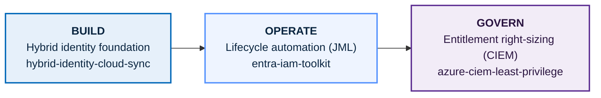

# Entra Identity Platform

Three hands-on labs that together cover the identity and access management lifecycle in Microsoft Entra ID and Azure: **build** the hybrid identity foundation, **operate** it with lifecycle automation, and **govern** entitlements down to least privilege.

---

## Overview

This repository collects three self-contained labs that map to how an IAM team actually works: you stand up an identity environment, you run it day to day, and you govern what people can access. Each lab is built and evidenced against a live tenant, and each has its own detailed README with steps, screenshots, and an honest troubleshooting record.

The labs are grouped here so the through-line is visible. Individually they are three tasks. Together they are a demonstration of the identity lifecycle from on-premises foundation through automated operations to entitlement governance.

## The lifecycle

## The labs

| Lab | Stage | What it demonstrates |
|-----|-------|----------------------|
| [hybrid-identity-cloud-sync](./hybrid-identity-cloud-sync) | Build | On-prem Active Directory to Entra ID via Entra Cloud Sync and password hash sync, plus a full root-cause analysis of a sync-agent fault |
| [entra-iam-toolkit](./entra-iam-toolkit) | Operate | Joiner-mover-leaver automation, access reporting, and audit export with the Microsoft Graph PowerShell SDK |
| [azure-ciem-least-privilege](./azure-ciem-least-privilege) | Govern | Detecting four over-provisioning findings from Activity logs and remediating them to least privilege with PIM, scope reduction, access reviews, and a custom role |

---

### Build: Hybrid identity foundation

[`hybrid-identity-cloud-sync`](./hybrid-identity-cloud-sync)

Stands up the on-premises foundation that most enterprises actually run: a Windows Server domain controller for a new forest, an OU-scoped provisioning boundary, verified-domain UPN alignment so synced identities are sign-in ready, and the Entra Cloud Sync provisioning agent with password hash sync configured. The environment is fully built and correctly configured. The sync itself surfaced an agent-connectivity fault, which is diagnosed here layer by layer (DNS, connectivity, TLS, certificate trust, permissions, host security) and isolated through the agent's own trace log to an environmental WebSocket failure rather than any misconfiguration. The build and the diagnosis are both intended deliverables.

**Skills:** Windows Server AD DS, Entra Cloud Sync, password hash sync, UPN and verified-domain configuration, OU-scoped provisioning, gMSA, structured root-cause analysis.

[Details →](./hybrid-identity-cloud-sync)

### Operate: Identity lifecycle automation

[`entra-iam-toolkit`](./entra-iam-toolkit)

A set of Microsoft Graph PowerShell scripts that run the joiner-mover-leaver lifecycle as repeatable automation instead of portal clicks: bulk provisioning, idempotent group assignment, desired-state reconciliation that strips privilege creep, a "who has access to what" report, enterprise offboarding that disables rather than deletes, and audit-log export so the toolkit produces the evidence of its own operations. Includes a documented debugging trail of five real failures, several of which first presented as false success.

**Skills:** Graph PowerShell SDK, JML automation, least-privilege remediation, idempotent and honest-failure scripting, governance reporting, audit evidence.

[Details →](./entra-iam-toolkit)

### Govern: Entitlement right-sizing (CIEM)

[`azure-ciem-least-privilege`](./azure-ciem-least-privilege)

The entitlement plane: not who someone is, but what they can do to cloud resources and whether that access is right-sized. The lab seeds four realistic over-provisioning states, proves each is over-provisioned by correlating granted permissions against actual usage in KQL, then walks each down to least privilege using PIM just-in-time access, scope reduction, an access review with auto-apply, and a purpose-built custom role. It also names the boundary of native Azure CIEM honestly rather than overclaiming a dedicated engine.

**Skills:** Azure RBAC scope hierarchy, standing vs just-in-time access, PIM for Azure resources, access reviews, custom role authoring, KQL entitlement detection.

[Details →](./azure-ciem-least-privilege)

---

## Skills demonstrated across the platform

- **Hybrid identity:** on-prem AD to Entra ID synchronization, Cloud Sync, password hash sync, UPN routing
- **Identity lifecycle (JML):** automated provisioning, group and access management, desired-state reconciliation, enterprise offboarding
- **Privileged access:** PIM eligible assignments, just-in-time activation with MFA and justification, break-glass reasoning
- **Governance:** access reviews, least-privilege enforcement, custom RBAC roles, privilege-creep detection
- **Detection and evidence:** KQL over Azure Activity and directory logs, audit export, access reporting
- **Engineering rigour:** idempotency, graceful licensing degradation, honest failure handling, and structured root-cause analysis

## Tech stack

Microsoft Entra ID (P2), Windows Server AD DS, Microsoft Entra Cloud Sync, Microsoft Graph PowerShell SDK, Azure RBAC, Azure Privileged Identity Management, Azure Monitor and Log Analytics (KQL), Azure CLI, PowerShell 7+.

## About

Built by Jeffrey Lam-Ping-Fong, a fourth-year Honours Bachelor of Information Technology student specializing in cybersecurity, with a focus on identity and access management.

- LinkedIn: https://www.linkedin.com/in/jeffrey-lam-ping-fong-07a649321
