# Azure CIEM: Least-Privilege Entitlement Right-Sizing

> A cloud infrastructure entitlement management (CIEM) lab built on Microsoft Entra ID and Azure RBAC. It seeds four realistic over-provisioning findings, detects each one from Azure Activity logs with KQL, and remediates them down to least privilege using PIM just-in-time access, scope reduction, access reviews, and a purpose-built custom role. This is the entitlement plane of the identity chain: not who someone is, but what they can do to cloud resources, and whether that access is right-sized.


---

## Why this lab

Most identity work stops at authentication and provisioning. CIEM is the layer after that: once an identity exists, what permissions does it actually hold against cloud resources, are those permissions used, and can they be tightened to least privilege. Cloud entitlement right-sizing is one of the fastest-growing areas of IAM, and this lab demonstrates the full detect-and-remediate loop using only native Azure tooling.

The lab deliberately builds over-provisioned states first, proves they are over-provisioned by correlating granted permissions against actual usage, then walks each one down to least privilege.

---

## Architecture

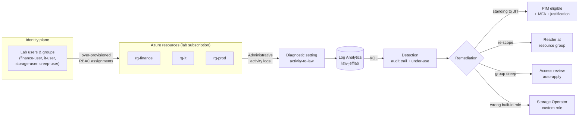

---

## Environment

| Component | Detail |
|---|---|
| Tenant | Entra ID lab tenant (Entra ID P2 trial for PIM and access reviews) |
| Subscription | Dedicated lab subscription under the lab tenant |
| Region | Canada Central |
| Resource groups | `rg-finance`, `rg-it`, `rg-prod` (models business separation) |
| Resources | Storage accounts and a Key Vault (targets for RBAC scoping) |
| Evidence pipeline | Subscription Activity log exported to Log Analytics workspace `law-jefflab` |
| Identities | `finance-user`, `it-user`, `storage-user`, `creep-user`, plus `Engineering` and `Security` groups |

Everything except PIM and access reviews is on free Azure functionality. PIM for Azure resources and access reviews require Entra ID P2.

### Evidence pipeline

Before any findings were seeded, the subscription Activity log was wired into Log Analytics so that every role-assignment write and administrative operation was captured from the start. A detection pipeline that predates the findings is what makes the evidence credible.

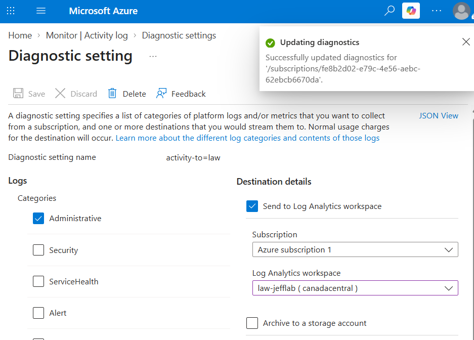

---

## The four findings

Each finding follows the same trio: the over-provisioned **before** state, the **detection** that catches it, and the **after** state once remediated.

### 1. Standing privileged access to just-in-time

**Finding:** `finance-user` held **Owner at subscription scope** as a permanent, always-on assignment, but only ever performed a handful of read/write operations inside a single resource group.

**Remediation:** removed the standing Owner assignment and replaced it with a **PIM-eligible** assignment that must be activated on demand, gated by **MFA and a written justification** and time-limited so it self-expires.

<details>
<summary>Evidence</summary>

**Before**: standing Owner at subscription scope

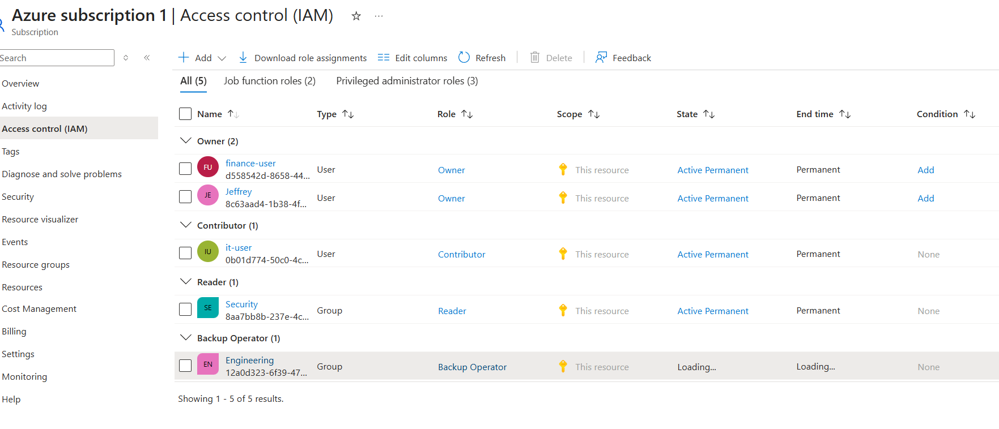

**Detect**: broad grant, narrow actual usage (the core CIEM signal)

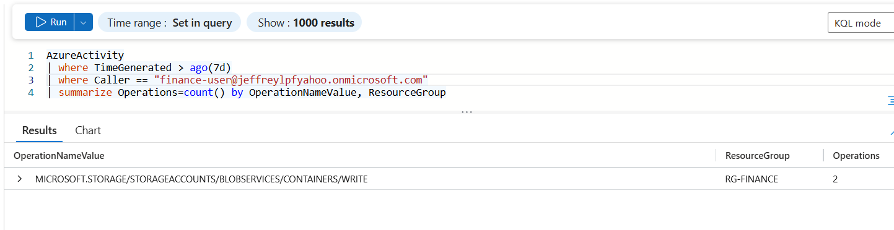

**After**: role settings enforcing MFA and justification on activation

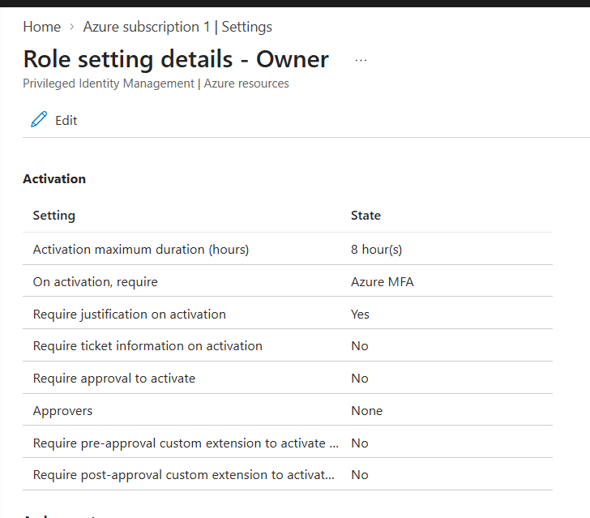

**After**: eligible assignment in place of standing access

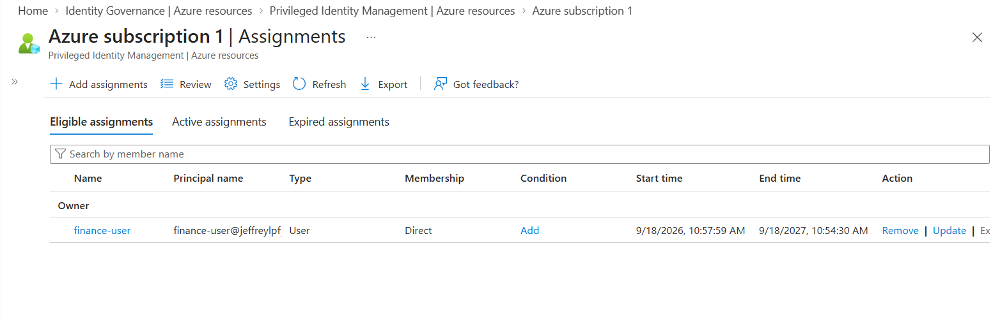

**After**: activated on demand, time-bound with an expiry

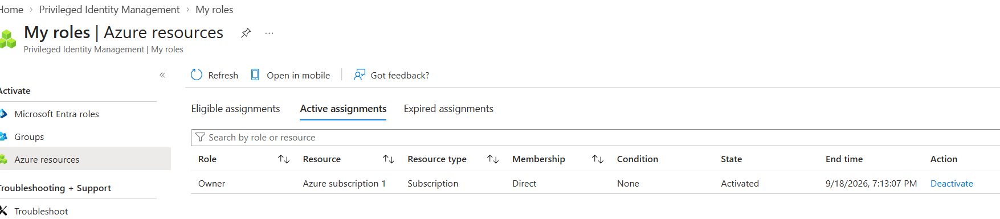

</details>

### 2. Scope too broad

**Finding:** `it-user` held **Contributor at subscription scope** but only ever operated inside `rg-it`.

**Remediation:** removed the subscription-level assignment and granted **Reader at `rg-it` scope** instead, matching access to where the work actually happens.

<details>
<summary>Evidence</summary>

**Before**: Contributor at subscription scope (see the subscription role assignments)


**Detect**: all activity landed in a single resource group

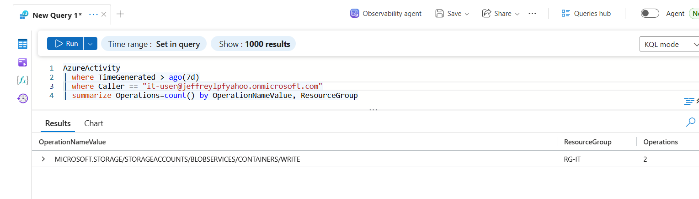

**After**: re-scoped to Reader at rg-it

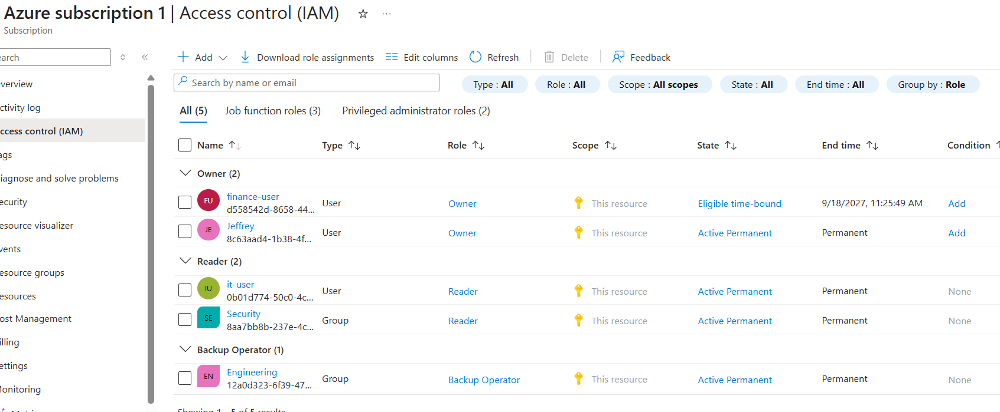

</details>

### 3. Group-based privilege creep

**Finding:** `creep-user` accumulated access through **multiple group memberships** (`Engineering` carrying Backup Operator, `Security` carrying Reader), so effective permissions exceeded the role.

**Remediation:** ran an **access review** scoped to the `Engineering` group with auto-apply enabled, and removed the excess membership so standing Backup Operator was stripped while legitimate Reader access remained.

<details>
<summary>Evidence</summary>

**Before**: creep-user's group memberships

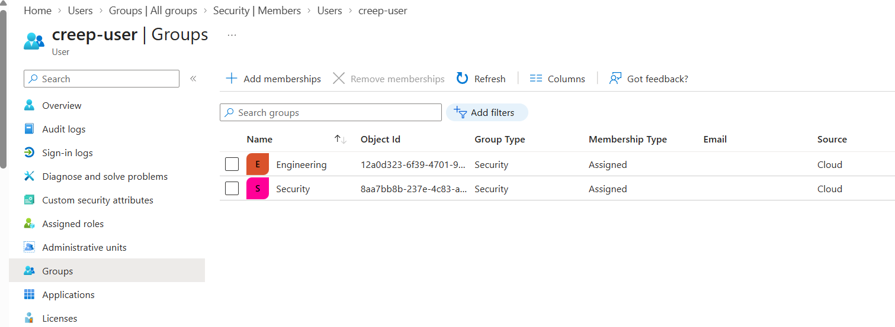

**Detect**: stacked effective access from group inheritance

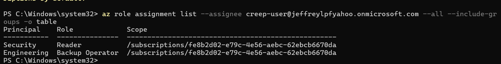

**After**: access review decision (governance artifact)

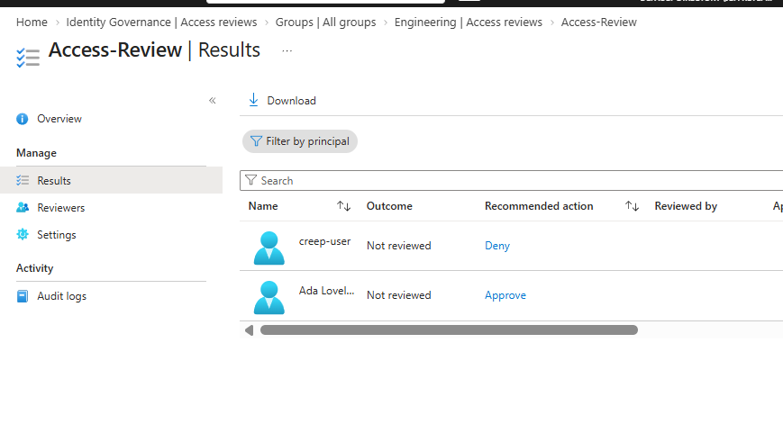

**After**: effective access reduced, not zeroed

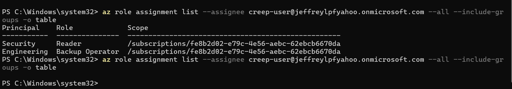

</details>

### 4. Wrong built-in role (too broad) to least-privilege custom role

**Finding:** `storage-user` held **Contributor at `rg-it`** when the job was only to manage storage. Contributor grants full management of every resource type in the group, including the Key Vault and the Log Analytics workspace.

**Remediation:** authored a **least-privilege custom role** (`Storage Operator (custom)`) scoped to storage actions and blob data actions only, and replaced the Contributor assignment with it.

<details>
<summary>Evidence</summary>

**Before**: Contributor at rg-it

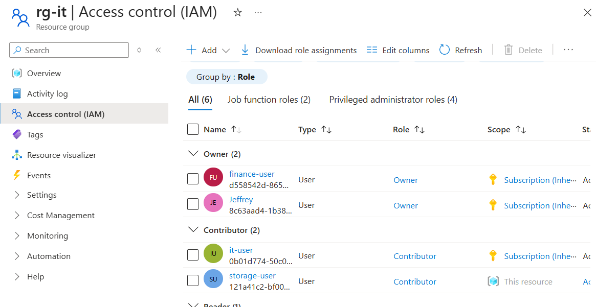

**Detect**: activity confined to storage operations

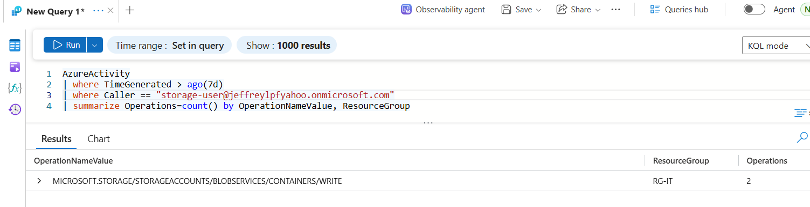

**After**: custom role assigned in place of Contributor

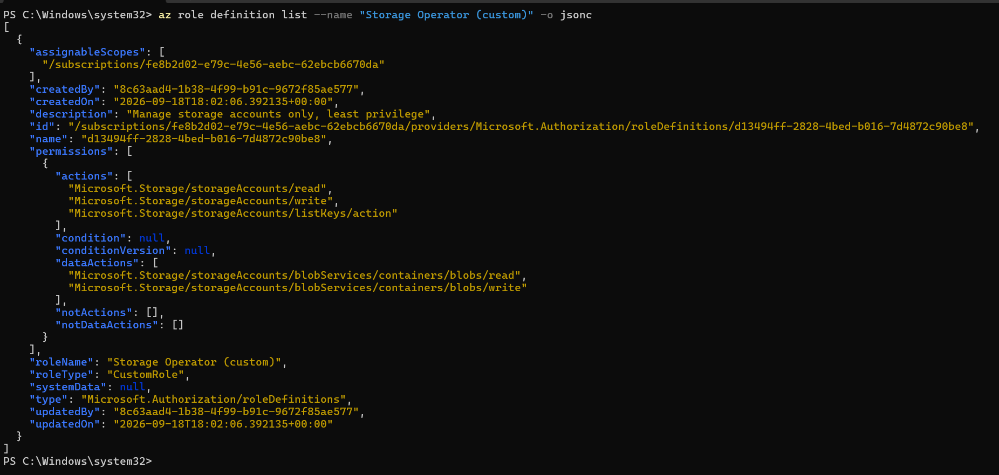

</details>

The custom role definition is included in this repo as [`storage-operator-role.json`](storage-operator-role.json).

---

## Detection layer (KQL)

All queries run against the `AzureActivity` table in `law-jefflab`.

**Role-assignment audit trail** (who granted what, and when):

```kusto
AzureActivity
| where OperationNameValue == "MICROSOFT.AUTHORIZATION/ROLEASSIGNMENTS/WRITE"
| where ActivityStatusValue == "Success"
| project TimeGenerated, Caller, _ResourceId
```

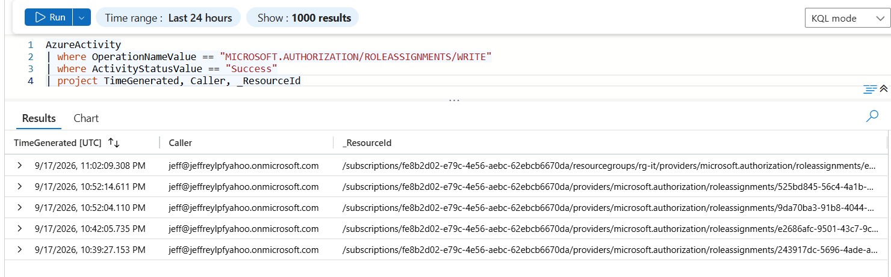

**Under-use** (broad grant versus narrow actual usage), the headline CIEM query:

```kusto
AzureActivity
| where TimeGenerated > ago(7d)
| where Caller == "<principal-object-id>"
| summarize Operations = count() by OperationNameValue, ResourceGroup
| order by Operations desc
```

Run once per over-provisioned principal. A user holding Owner at subscription scope whose operations all fall inside one resource group is, by definition, over-provisioned.

---

## Design decisions and lessons learned

Building the environment was quick. The real work, and the more valuable part, was diagnosing why the evidence did not appear where expected. Each of these is a genuine Azure logging or RBAC nuance worth knowing.

**Azure-native CIEM has a boundary, and naming it is the honest thing to do.** A dedicated CIEM engine (for example Microsoft Entra Permissions Management) computes usage-based least privilege automatically. Native Azure does not. In this lab, the under-use evidence comes from correlating `AzureActivity` operations against granted permissions by hand in KQL. That is a legitimate manual CIEM method, and the gap is the reason the "future work" section points at a dedicated tool.

**Eligible is not the same as active.** In PIM, assignment type (Active versus Eligible) and duration (Permanent versus Time-bound) are independent axes. Eligible grants nothing until the user activates it, so seeding a finding as Eligible accidentally pre-remediates it. Every over-provisioned "before" state must be Active for the finding to hold.

**KQL scope matters.** `AzureActivity` lives inside a specific Log Analytics workspace. Querying from `Monitor > Logs` at the wrong scope returns "no results" and masquerades as a broken pipeline. Entering `Logs` from inside the workspace guarantees the query reads the right table. A single scope mistake cost real time here.

**`Caller` is not always a UPN.** Operations performed by an admin log the caller as a UPN, but operations performed by the lab users often log as the principal's **object id** (a GUID). Filtering `Caller == "user@domain"` then silently matches nothing. The fix is to filter on the object id, or use `has` against an id fragment. This is a classic Log Analytics gotcha.

**The portal custom-role wizard and the `az` CLI use different JSON schemas.** The CLI format is flat (`Name`, `Actions`, `AssignableScopes` at the top level). The portal wizard expects the ARM role-definition schema, where the same fields live inside a `properties` object with `roleName`, `permissions[]`, and lowercased `assignableScopes`. Pasting the CLI format into the portal throws `"properties" property not present`.

**Custom roles take time to propagate.** A custom role returns success immediately but is not selectable in the portal assignment picker for several minutes. The CLI (`az role assignment create`) bypasses the portal cache and assigns it immediately once the definition exists.

**Access reviews are read-only in the management blade.** The owner/admin view of a review shows results but not the approve/deny controls. Decisions are recorded through the reviewer experience (the review's reviewer link or `myaccess.microsoft.com`), and auto-apply behaviour differs between member and guest users.

---

## Key concepts demonstrated

Cloud infrastructure entitlement management (CIEM); least-privilege enforcement at the resource layer; Azure RBAC scope hierarchy (subscription, resource group, resource); standing versus just-in-time privileged access; PIM for Azure resources with MFA and justification on activation; access reviews with auto-apply; custom RBAC role authoring; group-based privilege creep; and usage-based entitlement analysis via Activity-log correlation.

## Skills demonstrated

- Azure RBAC design and the subscription / resource-group / resource scope hierarchy
- Least-privilege remediation: scope reduction, role right-sizing, custom role authoring
- Privileged Identity Management (PIM) for Azure resources: eligible assignments, JIT activation, activation policy (MFA, justification, time-bound)
- Access reviews and identity governance
- Azure Monitor / Log Analytics and KQL for entitlement detection
- Control-plane versus data-plane logging, and structured troubleshooting of a logging pipeline

## Tech stack

Microsoft Entra ID (P2), Azure RBAC, Azure Privileged Identity Management, Azure Monitor, Log Analytics (KQL), Azure CLI.


