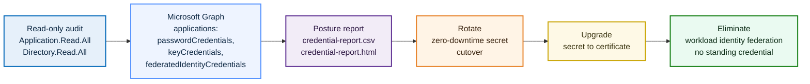

# Entra Credential Lifecycle: Kill the Standing Secret


A read-only PowerShell audit of how every application registration in an Entra tenant authenticates, plus the remediation path from the worst option to the best: rotate a client secret, upgrade it to a certificate, and finally eliminate it with workload identity federation so no standing credential exists at all. It is the remediation half of the non-human identity story whose detection half is [`entra-nhi-inventory`](../entra-nhi-inventory).

## Why this lab

A non-human identity that authenticates with a client secret is holding a long-lived plaintext bearer credential: no user, no MFA, no device. The secret is created once, pasted into app configuration or a CI variable, and then almost never rotated, often on a one or two year expiry. If it leaks, it is full application access until it expires. The sibling inventory lab finds these standing secrets; this lab closes them out. It walks the full lifecycle on a real app, from detecting the secret to removing it, and proves at the end that the application still authenticates with nothing standing behind it.

The design choice at the centre of the lab is an ordering, not a tool: federation is better than a certificate, which is better than a client secret. The audit scores against that ordering, and the remediation walks an app down it.

| Decision | Chosen | Rejected alternative | Why |
| :--- | :--- | :--- | :--- |
| Preferred credential for app-to-app and CI auth | Workload identity federation (OIDC) | A client secret, or a certificate | Federation has no standing credential to leak or rotate; the token is minted per run and expires in minutes |
| Interim credential when a secret must stay | Certificate | A longer-lived client secret | A certificate is not a plaintext bearer string, is harder to exfiltrate from config, and is easier to scope and attest |
| What drives the verdict | Deterministic policy and thresholds | A model judging each app | Credential posture is a policy question; the same tenant state must always produce the same report |
| Audit permissions | Read scopes only | A read-write app that could also rotate | The audit must not hold the write permission it is auditing others for; rotation and removal stay separate, owned actions |

## Architecture



## Environment

PowerShell 7+ with the `Microsoft.Graph.Authentication` module, and an Entra tenant where you can manage application credentials (Global Administrator or Application Administrator). The federation phase uses a GitHub repository and GitHub Actions. The certificate phase needs a way to make a self-signed certificate (`New-SelfSignedCertificate` on Windows, or `openssl`).

```powershell
Install-Module Microsoft.Graph.Authentication -Scope CurrentUser
./scripts/Invoke-CredentialAudit.ps1
```

The audit requests read scopes only, so it can report on credentials but never rotate, add, or remove one. Those are deliberate, owned actions done in the portal.

## The posture model

Each application gets a deterministic posture verdict, raised to the worst thing true about how it authenticates and never lowered. Thresholds live in [`policy/credential-policy.json`](./policy/credential-policy.json); the rules live in [`scripts/CredentialLifecycle.psm1`](./scripts/CredentialLifecycle.psm1).

| Rule | Trigger | Tier |
| :--- | :--- | :--- |
| Standing client secret | A valid (unexpired) client secret, flagged long-lived if its validity window exceeds the policy maximum | high |
| Certificate, no federation | A valid certificate and no federated credential | low |
| Federated, no standing credential | A federated credential and no valid secret or certificate | info |
| No credential configured | No secret, certificate, or federation at all | info |
| Expired credential attached | A past-expiry secret or certificate still present | medium (overlay) |
| Expiring soon | A valid credential within the policy window of expiry | medium (overlay) |

The two overlays raise an otherwise-low or info app to medium, so a certificate that is about to expire is surfaced before it fails.

## Walkthrough

> Screenshots are captured as you run each phase; the filenames noted below live under `screenshots/`.

### Phase 0: Seed a standing secret to fix

Create an app registration `cred-lifecycle-demo` and, under Certificates & secrets, add a client secret with a long expiry. This is the bad starting state the rest of the lab remediates.

`Capture → screenshots/00-demo-app-standing-secret.png`: the app showing one client secret with a far-off expiry.

### Phase 1: Detect every credential

Run the audit. It enumerates every application registration, flattens its credentials into one row per credential with age and days-to-expiry, and gives each app a posture verdict. The demo app shows up as high for holding a standing secret.

```powershell
./scripts/Invoke-CredentialAudit.ps1
```

`Capture → screenshots/01-credential-report.png`: the console summary and HTML report, with `cred-lifecycle-demo` flagged high.

### Phase 2: Rotate, then upgrade to a certificate

First, a zero-downtime secret rotation: add a second client secret, cut the app over to it, then delete the old one. The overlap window is the point, there is never a moment where the app cannot authenticate.

`Capture → screenshots/02-secret-rotation.png`: the two secrets overlapping, then the old one removed.

Second, upgrade from secret to certificate. Generate a self-signed certificate, upload the public key to the app, and authenticate with it instead, then remove the secret.

```powershell
$cert = New-SelfSignedCertificate -Subject "CN=cred-lifecycle-demo" -CertStoreLocation "Cert:\CurrentUser\My"
# upload the exported .cer in the portal, then:
Connect-MgGraph -ClientId <appId> -TenantId <tenantId> -CertificateThumbprint $cert.Thumbprint
```

`Capture → screenshots/03-cert-auth.png`: the app showing a certificate and no client secret, plus a successful certificate-based sign-in.

### Phase 3: Eliminate the secret with federation

Configure a federated identity credential on the app trusting GitHub Actions, scoped to this repo and the `main` branch, then run a workflow that authenticates with a short-lived OIDC token and no secret. Full steps are in [`federation/setup-federation.md`](./federation/setup-federation.md); the workflow is [`federation/cred-federation.yml`](./federation/cred-federation.yml). Finish by deleting the secret entirely.

`Capture → screenshots/04-federated-credential-config.png`: the federated credential showing the subject (repo and branch).
`Capture → screenshots/05-github-actions-no-secret.png`: the GitHub Actions run authenticating to Graph with no secret.

### Phase 4: Prove it, and tie it back to the inventory

Re-run the audit: `cred-lifecycle-demo` now reports federated with zero secrets. Then re-run the [`entra-nhi-inventory`](../entra-nhi-inventory) scan and confirm its standing-secret finding on the app has cleared. One tool detects, the other confirms the fix.

`Capture → screenshots/06-credential-report-clean.png`: the re-run audit showing the app as federated, zero secrets.
`Capture → screenshots/07-inventory-finding-cleared.png`: the NHI inventory re-run with the standing-secret finding gone.

A sanitized example of the report shape is in [`samples/credential-report.sample.csv`](./samples/credential-report.sample.csv).

## Key concepts demonstrated

- **The credential hierarchy, made concrete:** federation beats a certificate beats a client secret, shown by walking one app all the way down it rather than asserting it.
- **Zero standing credential, not just a shorter secret:** workload identity federation removes the thing that can leak, rather than trading a two-year secret for a shorter one.
- **Deterministic, explainable posture:** every verdict is a transparent function of credential type, age, and expiry, so the same tenant state always produces the same report.
- **Least privilege applies to the audit too:** the tool that reports on credentials holds read scopes only and cannot rotate or remove one.

## Skills demonstrated

- **Credential lifecycle management:** secret rotation with a cutover window, certificate-based app authentication, and workload identity federation for CI and app-to-app auth.
- **Microsoft Graph:** enumeration of application credentials (`passwordCredentials`, `keyCredentials`, `federatedIdentityCredentials`) through `Invoke-MgGraphRequest`, with age and expiry analysis.
- **GitHub Actions OIDC:** a federated identity credential scoped to one repo and branch, and a secretless workflow that exchanges a GitHub OIDC token for a Graph token.
- **Policy-as-data scoring:** a floor-only posture model with thresholds kept in reviewable JSON.

## Lessons Learned

- **Federation is the only option that removes the thing that leaks.** Rotating a secret or moving to a certificate shortens the exposure window; federation removes the standing credential entirely, so there is nothing to steal from config or CI in the first place. The lab is ordered that way on purpose.
- **Rotation needs an overlap, or it is an outage.** The correct way to rotate a secret is to add the new one, cut over, and only then remove the old one. Deleting first and creating second is a self-inflicted outage, and documenting the overlap window is the difference between knowing the pattern and having run it.
- **A certificate is better, but it is not free.** Moving from a secret to a certificate removes the plaintext bearer string, but the certificate then becomes the thing that expires and must be rotated. The audit treats an expiring certificate as a finding for exactly this reason.
- **Deleting the secret in Entra is not the end of the lifecycle.** Copies of the old secret can still sit in CI variables, config files, and developer machines. Removing it from the directory closes the authentication path, but secret sprawl is a separate cleanup, and a credential audit only sees the directory side of it.
- **Scope the federation trust as narrowly as the job allows.** A subject that trusts any branch, any environment, or a shared reusable workflow widens the trust well beyond one pipeline. Narrow it to the exact repo and ref, and treat broadening it as a change that needs review.
