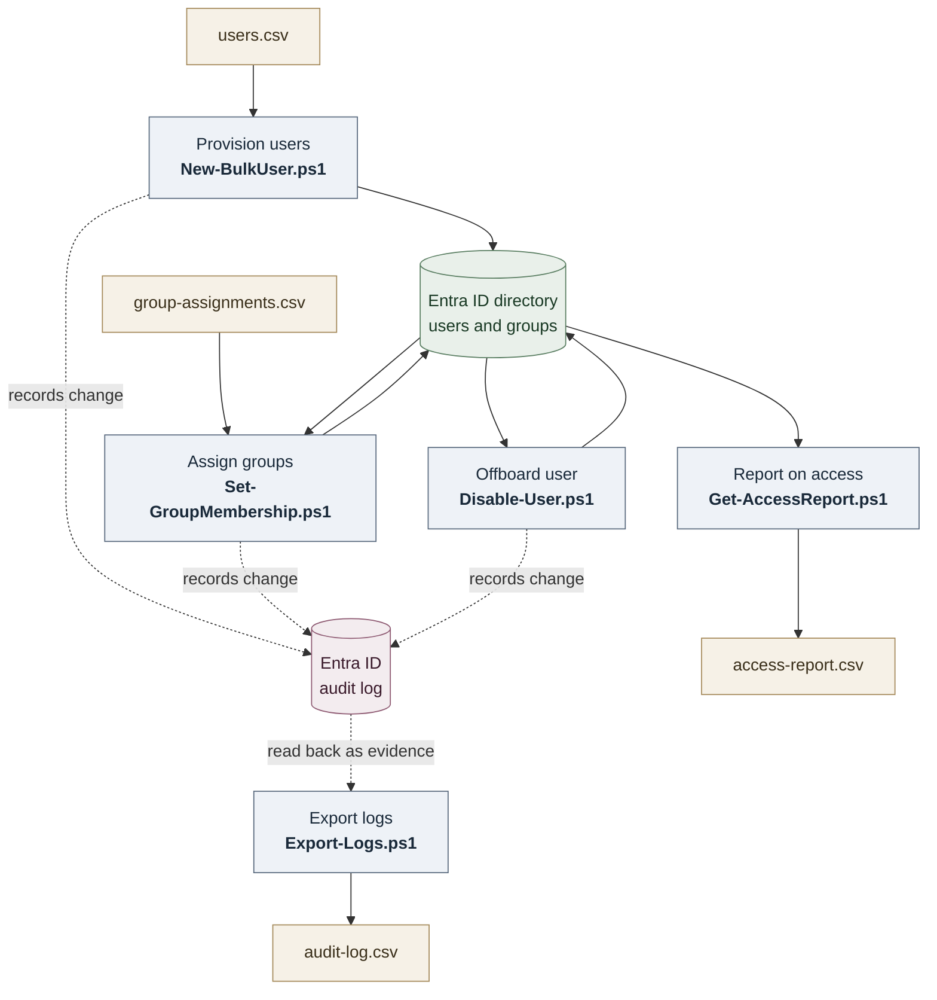
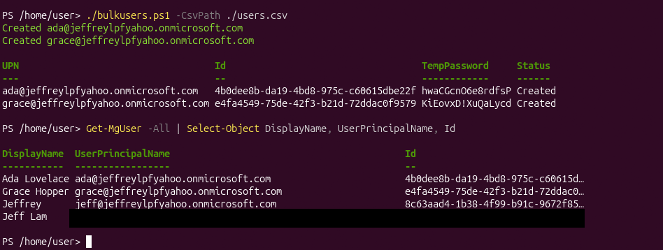
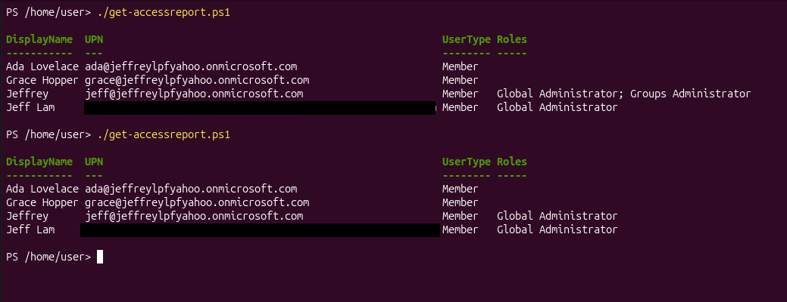
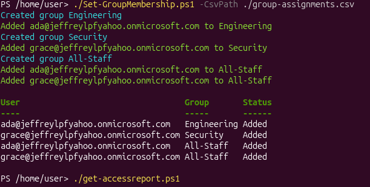
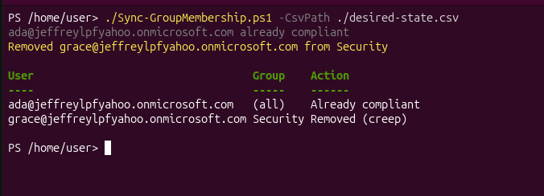
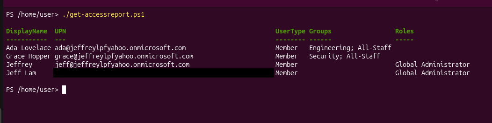
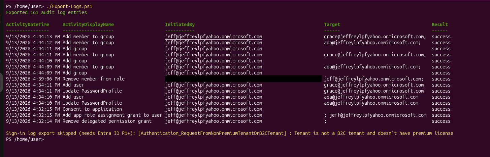
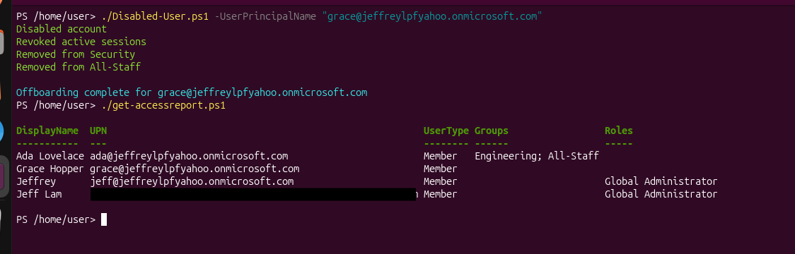

# Entra ID IAM Automation Toolkit

A set of PowerShell scripts that automate the full identity lifecycle in Microsoft Entra ID using the Microsoft Graph PowerShell SDK. The toolkit covers **joiner, mover, and leaver** operations plus **access reporting** and **audit log export**, and every operation it performs is captured in the tenant's own audit trail.

Built and tested against a live Entra ID tenant. Each script below is shown running against real users, with the resulting state changes verified through the access report.

## What this demonstrates

- **Identity lifecycle automation (JML):** provisioning, group/access management, and deprovisioning as repeatable scripts rather than manual portal clicks
- **Least privilege in practice:** identifying and removing a redundant role assignment, and reasoning about an over-privileged external identity
- **Governance reporting:** a "who has access to what" report covering users, group memberships, directory roles, and account status
- **Audit and evidence:** exporting the directory audit log, so the toolkit produces the proof that its own operations happened
- **Engineering judgement:** idempotent scripts, graceful handling of licensing limits, disable-not-delete offboarding, and a documented debugging trail (see [Troubleshooting](#troubleshooting-and-lessons-learned))

## Architecture

The five scripts map to the joiner-mover-leaver lifecycle. Every mutating operation is recorded in the Entra ID audit log, which the export script reads back out as evidence.



---

## The scripts

| Script | Lifecycle stage | What it does |
|--------|-----------------|--------------|
| `New-BulkUser.ps1` | Joiner | Bulk-creates users from a CSV with a provisioning report |
| `Set-GroupMembership.ps1` | Mover | Creates groups if missing and assigns membership, idempotently |
| `Get-AccessReport.ps1` | Governance | Exports every user with groups, roles, and status |
| `Export-Logs.ps1` | Audit | Exports directory audit logs, and sign-in logs on P1+ tenants |
| `Disable-User.ps1` | Leaver | Disables account, revokes sessions, strips group memberships |

## Prerequisites

- PowerShell 7+
- Microsoft Graph PowerShell SDK modules: `Microsoft.Graph.Users`, `Microsoft.Graph.Groups`, `Microsoft.Graph.Reports`, `Microsoft.Graph.Users.Actions`
  ```powershell
  Install-Module Microsoft.Graph.Users, Microsoft.Graph.Groups, Microsoft.Graph.Reports, Microsoft.Graph.Users.Actions -Scope CurrentUser
  ```
- An Entra ID tenant where you hold **Global Administrator** (a free tenant created via an Azure free account is sufficient; Entra ID Free covers everything here except sign-in log export, which needs P1+)
- Connect with the scopes the toolkit uses, and grant admin consent when prompted:
  ```powershell
  Connect-MgGraph -TenantId "yourtenant.onmicrosoft.com" `
      -Scopes "User.ReadWrite.All","Group.ReadWrite.All","Directory.Read.All","AuditLog.Read.All"
  ```

## Usage and output

### 1. Provision users (Joiner)

```powershell
./scripts/New-BulkUser.ps1 -CsvPath ./samples/users.csv
```

Reads users from CSV, generates a random temp password per user with force-change-on-first-signin, and writes a provisioning report. Failed rows are reported honestly rather than falsely marked created.



### 2. Least-privilege cleanup (Governance)

Before assigning any access, the admin account itself was cleaned up. It carried both Global Administrator and a redundant Groups Administrator role, which Global Administrator already fully includes. The narrower role was removed in the Entra admin center and the change verified with the access report:

```powershell
./scripts/Get-AccessReport.ps1
```

Before, the account shows both roles; after, only Global Administrator remains. Note there is no Groups column populated yet, because this step happens before any groups are created:



### 3. Assign group membership (Mover)

```powershell
./scripts/Set-GroupMembership.ps1 -CsvPath ./samples/group-assignments.csv
```

Creates each security group if it does not exist, then adds users. The script is idempotent: a second run reports "already a member" instead of erroring or duplicating, which makes it safe to schedule.



### 4. Reconcile access to desired state (Mover)

```powershell
./scripts/Sync-GroupMembership.ps1 -CsvPath ./samples/desired-state.csv
```

Assigning access is only half of the Mover stage. The harder, more important half is revoking access a user should no longer have, which is how privilege creep accumulates when someone changes roles but keeps their old group memberships. This script reconciles each user's actual memberships against a desired-state CSV: it adds what is missing, removes what should not be there, and leaves correct memberships untouched. Where `Set-GroupMembership.ps1` only grants, this one governs, so a user stripped of a stale group is reported as removed (creep) rather than left over-provisioned.



### 5. Report on access (Governance)

```powershell
./scripts/Get-AccessReport.ps1
```

The access report that ties the toolkit together: users created in step 1, placed in groups in step 3, surfaced here with their full group memberships, directory roles, and account status. This is the "who has access to what" view an IAM analyst produces constantly, and the Groups column is now populated because the memberships exist:



### 6. Export audit logs (Audit)

```powershell
./scripts/Export-Logs.ps1
```

Exports the directory audit log to CSV. The output is a timestamped, attributed record of every change made to the tenant, including the operations performed by the other scripts. Sign-in log export is attempted too, and skips gracefully on a Free-tier tenant.



### 7. Offboard a user (Leaver)

```powershell
./scripts/Disable-User.ps1 -UserPrincipalName "grace@yourtenant.onmicrosoft.com"
```

Runs the full enterprise leaver workflow: disables the account, revokes active sessions and refresh tokens, removes all group memberships, removes assigned licenses where present (to reclaim cost), hides the user from the Global Address List, and clears the manager attribute, writing an offboarding record for the audit trail. It deliberately does **not** delete the object, so audit history survives and mailbox or file access can be reassigned during a retention period.

The access report immediately after shows the leaver stripped of all groups while other users are untouched, which is exactly the state change an auditor verifies:


## Design decisions

- **Disable, don't delete, on offboarding.** Deleting an account immediately destroys audit history and breaks mailbox/file reassignment. The correct leaver action is disable + revoke sessions + strip access, retaining the object for a defined period.
- **Idempotency.** `Set-GroupMembership.ps1` can be run repeatedly without error or duplication, which is what separates an automation script from a one-shot command.
- **Graceful degradation on licensing.** Sign-in log export requires Entra ID P1. Rather than crash on a Free tenant, the script detects the licensing limitation and skips that half with a clear message.
- **Honest failure reporting.** Every write uses `-ErrorAction Stop` inside try/catch so failures route to the error path instead of being silently reported as success.

## Troubleshooting and lessons learned

The debugging was as instructive as the scripts. Five real failures were diagnosed and fixed, several of which presented as success, which is the hardest class to catch.

1. **False-success from non-terminating errors.** The bulk-create script initially reported users as "Created" while they were not. Graph cmdlet errors are non-terminating by default, so a failed `New-MgUser` printed an error but skipped the catch block, falling through to the success path with a null object. Fix: `-ErrorAction Stop` on the write, so failures actually route to the catch.

2. **Personal (MSA) identity vs work identity.** Directory writes failed with `405 MethodNotAllowed` and `Get-MgDomain` returned `400 not supported for MSA accounts`. The session was authenticated as a personal Microsoft account (its `HomeAccountId` carried the well-known consumer tenant GUID `9188040d-...`) even though it was pointed at a real tenant. A consumer identity is blocked from directory-management operations. Fix: create a cloud-only native admin and authenticate as that work account.

3. **Insufficient role selection.** After creating the native admin, it was assigned **Groups Administrator**, which can only manage groups. It could neither create users nor grant application consent. Fix: assign **Global Administrator**, which resolved both the user-creation block and the consent block below.

4. **Admin consent for admin-restricted scopes.** Requesting `User.ReadWrite.All` / `AuditLog.Read.All` produced "Need admin approval", because those scopes are admin-restricted and only a privileged admin can consent to them for the Graph CLI app. Fix: as Global Administrator, use the "Consent on behalf of your organization" option at sign-in.

5. **Silent deserialization filter bug.** The access report showed empty group columns despite memberships existing. The original logic filtered `Get-MgUserMemberOf` results on an `@odata.type` key in `AdditionalProperties` that did not reliably deserialize. Fix: use the strongly-typed `Get-MgUserMemberOfAsGroup` / `Get-MgUserMemberOfAsDirectoryRole` cmdlets, which return real objects with a `DisplayName` property.

A sixth issue worth noting: the offboarding script's session-revocation step failed silently when `Microsoft.Graph.Users.Actions` was not installed, yet the script still reported "complete". This is captured as a known limitation in `Disable-User.ps1`: in a production tool, session revocation should be a critical step whose failure marks the offboarding incomplete.

## Findings surfaced by the toolkit

Running the access report against the lab tenant produced two genuine governance findings, which is what the report is for:

- **Redundant role assignment:** the admin account held Groups Administrator on top of Global Administrator. Remediated by removing the redundant role.
- **Over-privileged external identity:** a member-type external account holds Global Administrator. Because it is the tenant's founding account, Entra blocks its role removal to prevent lockout. Documented as an accepted break-glass identity with MFA enforced as the compensating control, which is a legitimate finding-to-decision governance outcome.

## Lab environment

Built on a Microsoft Entra ID Free tenant created for lab use. Test users (Ada Lovelace, Grace Hopper) are fictional. Sign-in log export and other P1/P2 features can be enabled with a free Entra ID P2 trial in the same tenant.
