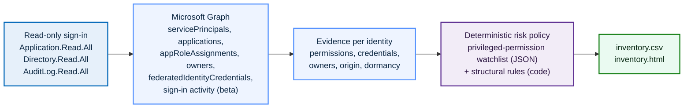

# Entra NHI Inventory: Discovering and Risk-Ranking Non-Human Identities


A read-only PowerShell tool that enumerates every service principal and app registration in an Entra tenant, gathers the posture evidence a security reviewer needs for each, and ranks them by a deterministic risk policy into a CSV and a self-contained HTML report. It answers the first question any identity team cannot answer about its non-human identities: which ones exist, who owns them, how they authenticate, and which are dangerous.

## Why this lab

Most identity programs are built around people: joiner-mover-leaver, access reviews, privileged access management. The identities that actually outnumber people in a modern tenant are non-human: service principals, app registrations, and managed identities that hold application permissions, carry long-lived secrets, and sign in with no user and no MFA. They are created for a project, granted broad permissions for convenience, and then forgotten. Nobody recertifies them, their secrets never rotate, and the person who created them has often left.

This lab is the discovery and triage layer the rest of the platform assumes exists. Where [`azure-ciem-least-privilege`](../azure-ciem-least-privilege) right-sizes what human-assigned principals can do to Azure resources, this inventories the non-human side of the directory and scores it. It is deliberately not agentic: there is no model in the decision path, only Microsoft Graph and a transparent, deterministic policy, so every verdict is explainable and repeatable. The one design choice worth stating up front is that the scanner authenticates with read scopes only, which makes it a least-privilege non-human identity that cannot change the identities it inspects.

| Decision | Chosen | Rejected alternative | Why |
| :--- | :--- | :--- | :--- |
| What drives the verdict | Deterministic policy in code and JSON | An LLM classifying each identity | A hygiene inventory must be explainable and identical on every run; risk tiers are a policy question, not a judgement call |
| Scanner permissions | Read scopes only (Application.Read.All, Directory.Read.All, AuditLog.Read.All) | A read-write app for "remediation too" | The tool that inventories privileged identities must not itself be a privileged write identity; remediation is a separate, owned action |
| Privileged-permission list | External JSON watchlist | Hard-coded in the script | The definition of "privileged" is reviewed and version-controlled on its own, not buried in logic |
| Scope of the report | Tenant-owned and third-party apps, Microsoft first-party excluded by default | Everything Graph returns | A report listing hundreds of pre-consented Microsoft apps is noise; accountability is for the identities the tenant owns |

## Architecture



## Environment

The lab runs against a Microsoft Entra tenant with the Microsoft Graph PowerShell SDK installed (`Microsoft.Graph` module, PowerShell 7+). The service-principal sign-in activity used for dormancy is a beta Graph report that needs an Entra ID P1 or P2 plan and is not available in every tenant; the tool degrades gracefully and reports dormancy as unknown when it cannot read it, rather than assuming an identity is active.

```powershell
Install-Module Microsoft.Graph -Scope CurrentUser
./scripts/Invoke-NhiInventory.ps1
```

The first run opens an interactive sign-in and consents the three read scopes. No secret is stored anywhere, which is deliberate: the scanner has no standing credential to leak. A dedicated read-only app registration can be used instead for unattended runs, which is the natural production form and is noted in Lessons Learned.

## What it inventories

For every service principal the tool gathers the facts that decide whether a non-human identity is a risk.

| Evidence | Source | Why it matters |
| :--- | :--- | :--- |
| Granted application permissions | `appRoleAssignments`, resolved from GUIDs to names | Application permissions are consent-free standing access; a few of them are tenant-takeover capable |
| Credential type and age | `passwordCredentials`, `keyCredentials` | A standing client secret is a long-lived bearer token; its age is how long a leak would have gone unrotated |
| Federation | `federatedIdentityCredentials` | Federated credentials remove the standing secret; their presence changes how a secret should be read |
| Owners | `owners` | An identity with no owner has no accountable human and will never be recertified |
| Origin | `appOwnerOrganizationId`, `servicePrincipalType` | In-tenant, third-party, Microsoft first-party, and managed identity carry very different risk |
| Dormancy | `servicePrincipalSignInActivities` (beta) | An unused identity that still holds credentials is pure attack surface with no business value |
| Enabled state | `accountEnabled` | A disabled identity cannot authenticate, so its exposure is cleanup rather than active risk |

## The risk model

Risk is a deterministic function of the evidence, not a judgement. Severity tiers are ordered `info < low < medium < high < critical`, and the scanner raises an identity to the highest tier any rule triggers and never lowers it. That floor-only behaviour is the same principle used across the agentic projects: a verdict can be made stricter, never softer.

The privileged-permission watchlist lives in [`policy/high-privilege-app-roles.json`](./policy/high-privilege-app-roles.json) as data, so what counts as privileged is reviewed on its own. The structural rules live in [`scripts/NhiInventory.psm1`](./scripts/NhiInventory.psm1).

| Rule | Trigger | Tier |
| :--- | :--- | :--- |
| Privilege-escalation permission | `Application.ReadWrite.All`, `RoleManagement.ReadWrite.Directory`, `AppRoleAssignment.ReadWrite.All` | critical |
| Broad write or data permission | `Directory.ReadWrite.All`, `User.ReadWrite.All`, `Group.ReadWrite.All`, `Mail.Send`, and similar | high |
| Broad read permission | `Directory.Read.All`, `User.Read.All`, `Mail.Read`, and similar | medium |
| No accountable owner | In-tenant app identity with zero owners | high |
| Standing client secret | An enabled identity with one or more client secrets | high |
| Dormant but credentialed | Enabled, no sign-in in 90+ days, still holds a credential | high |
| Expired credential attached | A past-expiry secret or certificate still present | medium |
| Disabled but credentialed | Disabled identity that still holds a credential | medium |

`Application.ReadWrite.All` is ranked critical on purpose: an identity holding it can add a credential to any other application or service principal and impersonate it, so a single over-granted app is a path to every other non-human identity in the tenant.

## Walkthrough

> Screenshots are captured as you run each phase; the filenames noted below live under `screenshots/`.

### Phase 1: Connect read-only

Run the tool and complete the interactive sign-in. The consent prompt shows exactly three read scopes and no write scope, which is the first thing to evidence: the scanner cannot modify what it inspects.

`Capture → screenshots/01-consent-read-only-scopes.png`: the consent screen listing Application.Read.All, Directory.Read.All, AuditLog.Read.All.

### Phase 2: Enumerate every non-human identity

The tool pages through all service principals and app registrations, following `@odata.nextLink` so nothing is missed in a large tenant, and prints the counts it found. Microsoft first-party apps are filtered out so the report is about the identities the tenant owns.

`Capture → screenshots/02-enumeration-counts.png`: the console showing the service-principal and application counts.

### Phase 3: Gather posture evidence

For each identity the tool resolves its application permissions from GUIDs to names, reads its credentials and owners, checks for federation, classifies its origin, and looks up sign-in dormancy. This is the slow phase in a large tenant; a progress bar tracks it, and `-SkipSignInActivity` skips the beta lookup when it is unavailable.

`Capture → screenshots/03-evidence-progress.png`: the progress bar mid-run.

### Phase 4: Score and report

Each identity is scored against the policy and written to `output/inventory.csv` and `output/inventory.html`. The console prints a risk summary, worst tier first.

`Capture → screenshots/04-risk-summary-console.png`: the console risk summary (counts by tier).
`Capture → screenshots/05-inventory-html-report.png`: the HTML report, sorted with critical and high at the top.

A sanitized example of the output shape is in [`samples/inventory.sample.csv`](./samples/inventory.sample.csv).

### Phase 5: Validate the detection, then remediate

A clean report is only trustworthy if the rules have been seen to fire. Following [`redteam/seed-risky-app.md`](./redteam/seed-risky-app.md), plant one app that trips several rules at once (a critical Graph permission, a standing secret, and no owner), confirm it lands at the top as critical, then delete it and re-run to confirm the finding closes.

`Capture → screenshots/06-redteam-canary-critical.png`: the seeded canary at the top of the report as critical, with all three findings in its Why column.
`Capture → screenshots/07-after-remediation-clean.png`: the re-run after deletion, with the canary gone.

## Key concepts demonstrated

- **Non-human identity is its own attack surface:** application permissions, standing secrets, missing owners, and dormancy are the real risks, and they are different from the human-centric controls the rest of the platform covers.
- **Deterministic, explainable risk:** every verdict is a transparent function of evidence and a reviewable policy, with no model in the decision path, so the same tenant state always produces the same report.
- **Least privilege applies to the scanner too:** the tool that inventories privileged identities authenticates read-only and holds no standing credential, so it cannot become the thing it is looking for.
- **Detection you have watched fire:** a seeded canary proves each rule triggers on a real object before a clean report is trusted.

## Skills demonstrated

- **Microsoft Graph at scale:** paginated enumeration of service principals and applications, app-role GUID resolution, owners, federated credentials, and beta sign-in-activity reporting through `Invoke-MgGraphRequest`.
- **Non-human identity governance:** credential hygiene, ownership and accountability, dormancy, and privileged application-permission analysis.
- **Policy-as-data risk scoring:** a floor-only severity model split cleanly into a reviewable JSON watchlist and transparent structural rules.
- **PowerShell engineering:** a reusable module plus a parameterised orchestrator, graceful degradation on unavailable beta endpoints, and a self-contained HTML report.
- **Detection validation:** a documented red-team seeding procedure that exercises the rules end to end.

## Lessons Learned

- **The hardest part of NHI security is the inventory, not the fix.** Remediating an over-permissioned app is a few clicks; knowing it exists, that nobody owns it, and that it has a two-year-old secret is the real work, and it is exactly what no one has time to do by hand.
- **Read-only is a feature, not a limitation.** Keeping the scanner read-only means it is safe to run often and by anyone, and it sidesteps the irony of a privileged write identity whose job is to find privileged identities. Remediation stays a separate, owned, audited action.
- **Beta endpoints are honest about their limits, so the tool is too.** Service-principal sign-in activity is unavailable in some tenants and licence tiers, so dormancy is reported as unknown rather than guessed. An inventory that quietly treats "no data" as "safe" is worse than one that admits the gap.
- **Excluding Microsoft first-party apps is a judgement that has to be stated.** It makes the report usable, but it is a scoping decision a reviewer should be able to see and override, which is why it is a single switch rather than a silent filter.
