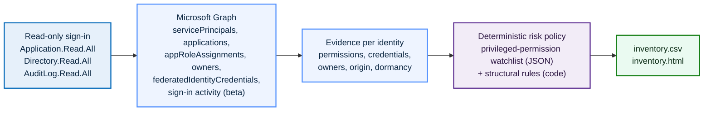
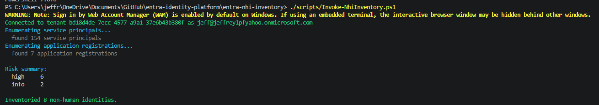
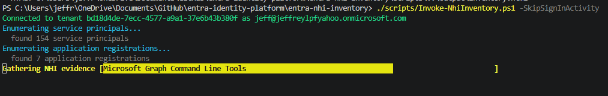
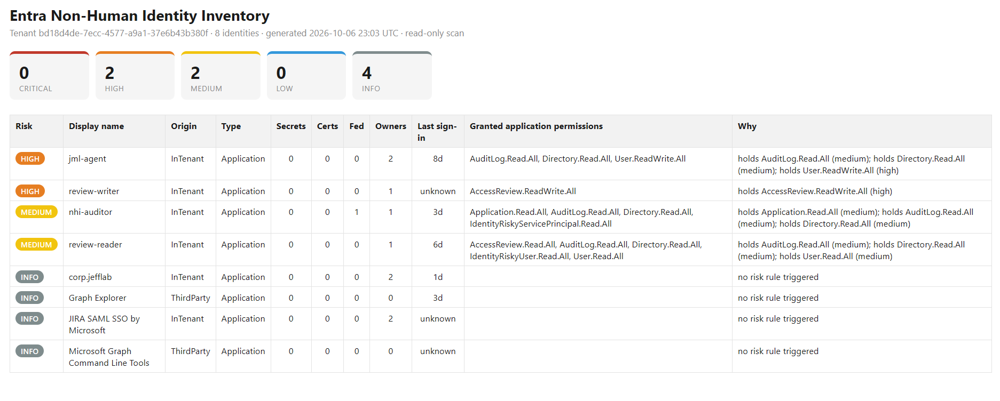
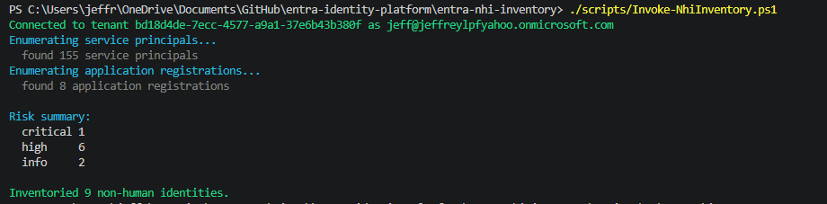
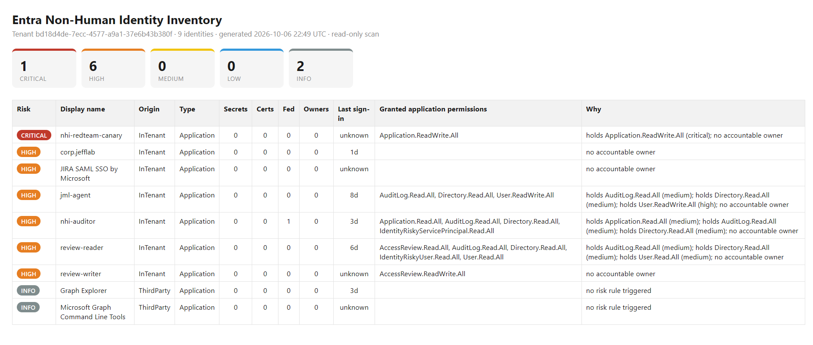
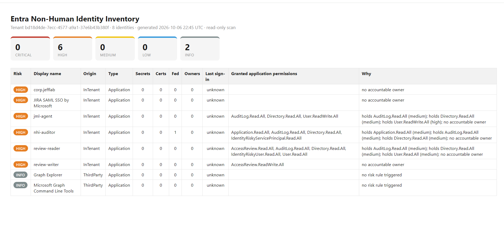

# Entra NHI Inventory: Discovering and Risk-Ranking Non-Human Identities


A read-only PowerShell tool that enumerates every service principal and app registration in an Entra tenant, gathers the posture evidence a security reviewer needs for each, and ranks them by a deterministic risk policy into a CSV and a self-contained HTML report. It answers the first question any identity team cannot answer about its non-human identities: which ones exist, who owns them, how they authenticate, and which are dangerous.

## Why this lab

Most identity programs are built around people: joiner-mover-leaver, access reviews, privileged access management. The identities that actually outnumber people in a modern tenant are non-human: service principals, app registrations, and managed identities that hold application permissions, carry long-lived secrets, and sign in with no user and no MFA. They are created for a project, granted broad permissions for convenience, and then forgotten. Nobody recertifies them, their secrets never rotate, and the person who created them has often left.

This lab is the discovery and triage layer the rest of the platform assumes exists. Where [`azure-ciem-least-privilege`](../azure-ciem-least-privilege) right-sizes what human-assigned principals can do to Azure resources, this inventories the non-human side of the directory and scores it. It is deliberately not agentic: there is no model in the decision path, only Microsoft Graph and a transparent, deterministic policy, so every verdict is explainable and repeatable. The one design choice worth stating up front is that the scanner authenticates with read scopes only, which makes it a least-privilege non-human identity that cannot change the identities it inspects.

| Decision | Chosen | Rejected alternative | Why |
| :--- | :--- | :--- | :--- |
| What drives the verdict | Deterministic policy in code and JSON | An LLM classifying each identity | A hygiene inventory must be explainable and identical on every run; risk tiers are a policy question, not a judgement call |
| Scanner permissions | Read scopes only (Application.Read.All, Directory.Read.All, AuditLog.Read.All) | A read-write app for "remediation too" | The tool that inventories privileged identities must not itself be a privileged write identity; remediation is a separate, owned action |
| Privileged-permission list | External JSON watchlist | Hard-coded in the script | The definition of "privileged" is reviewed and version-controlled on its own, not buried in logic |
| Scope of the report | Tenant-owned and third-party apps, Microsoft first-party excluded by default | Everything Graph returns | A report listing hundreds of pre-consented Microsoft apps is noise; accountability is for the identities the tenant owns |

## Architecture



## Environment

The lab runs against a Microsoft Entra tenant with PowerShell 7+ and the Microsoft Graph authentication module. Only `Microsoft.Graph.Authentication` is needed, not the full `Microsoft.Graph` meta-module, because the scanner authenticates with `Connect-MgGraph` and makes raw calls with `Invoke-MgGraphRequest` rather than using the typed cmdlets. The service-principal sign-in activity used for dormancy is a beta Graph report; in the P2 tenant this was built against it returned real last-sign-in ages for identities that had signed in and `unknown` for those with no recorded activity, so dormancy is never guessed. `-SkipSignInActivity` turns that lookup off for a faster run.

```powershell
Install-Module Microsoft.Graph.Authentication -Scope CurrentUser
./scripts/Invoke-NhiInventory.ps1
```

The first run opens an interactive sign-in and consents the three read scopes. No secret is stored anywhere, which is deliberate: the scanner has no standing credential to leak. A dedicated read-only app registration can be used instead for unattended runs, which is the natural production form and is noted in Lessons Learned.

## What it inventories

For every service principal the tool gathers the facts that decide whether a non-human identity is a risk.

| Evidence | Source | Why it matters |
| :--- | :--- | :--- |
| Granted application permissions | `appRoleAssignments`, resolved from GUIDs to names | Application permissions are consent-free standing access; a few of them are tenant-takeover capable |
| Credential type and age | `passwordCredentials`, `keyCredentials` | A standing client secret is a long-lived bearer token; its age is how long a leak would have gone unrotated |
| Federation | `federatedIdentityCredentials` | Federated credentials remove the standing secret; their presence changes how a secret should be read |
| Owners | `owners` on the application object and the service principal | An identity with no owner has no accountable human and will never be recertified; the two objects keep separate owner lists, so both are read and the union is counted |
| Origin | `appOwnerOrganizationId`, `servicePrincipalType` | In-tenant, third-party, Microsoft first-party, and managed identity carry very different risk |
| Dormancy | `servicePrincipalSignInActivities` (beta) | An unused identity that still holds credentials is pure attack surface with no business value |
| Enabled state | `accountEnabled` | A disabled identity cannot authenticate, so its exposure is cleanup rather than active risk |

## The risk model

Risk is a deterministic function of the evidence, not a judgement. Severity tiers are ordered `info < low < medium < high < critical`, and the scanner raises an identity to the highest tier any rule triggers and never lowers it. That floor-only behaviour is the same principle used across the agentic projects: a verdict can be made stricter, never softer.

The privileged-permission watchlist lives in [`policy/high-privilege-app-roles.json`](./policy/high-privilege-app-roles.json) as data, so what counts as privileged is reviewed on its own. The structural rules live in [`scripts/NhiInventory.psm1`](./scripts/NhiInventory.psm1).

| Rule | Trigger | Tier |
| :--- | :--- | :--- |
| Privilege-escalation permission | `Application.ReadWrite.All`, `RoleManagement.ReadWrite.Directory`, `AppRoleAssignment.ReadWrite.All` | critical |
| Broad write or data permission | `Directory.ReadWrite.All`, `User.ReadWrite.All`, `Group.ReadWrite.All`, `AccessReview.ReadWrite.All`, `Mail.Send`, and similar | high |
| Broad read permission | `Directory.Read.All`, `User.Read.All`, `Mail.Read`, and similar | medium |
| No accountable owner | In-tenant app identity with zero owners | high |
| Standing client secret | An enabled identity with one or more client secrets | high |
| Dormant but credentialed | Enabled, no sign-in in 90+ days, still holds a credential | high |
| Expired credential attached | A past-expiry secret or certificate still present | medium |
| Disabled but credentialed | Disabled identity that still holds a credential | medium |

`Application.ReadWrite.All` is ranked critical on purpose: an identity holding it can add a credential to any other application or service principal and impersonate it, so a single over-granted app is a path to every other non-human identity in the tenant.

## Walkthrough

This walkthrough follows a real run against a live P2 tenant. The tenant already contained the agent identities from a separate agentic-IAM project (`jml-agent`, `nhi-auditor`, `review-reader`, `review-writer`), so the inventory produced genuine, unscripted findings on day one, including a real owner-attribution gap the first run surfaced and the scan was then corrected for.

### Phase 1: Run the read-only scan

One command does everything. It connects with the three read scopes, pages through every service principal and application registration following `@odata.nextLink`, and prints what it found. In this tenant that was 155 service principals filtered down to the 8 the tenant actually owns, which is the whole point of excluding Microsoft first-party noise.

```powershell
./scripts/Invoke-NhiInventory.ps1
```

<details>
<summary>Console: connect, enumerate, and risk summary</summary>



The scanner signs in interactively and consents read scopes only (`Application.Read.All`, `Directory.Read.All`, `AuditLog.Read.All`), so it is itself a least-privilege identity that cannot change what it inspects.
</details>

### Phase 2: Watch the evidence gather

For each identity the tool resolves application permissions from GUIDs to names, reads credentials and owners from both the application object and the service principal, checks federation, classifies origin, and looks up sign-in dormancy. A progress bar tracks it. The dormancy lookup is a beta report, so `-SkipSignInActivity` skips it for a faster run.

```powershell
./scripts/Invoke-NhiInventory.ps1 -SkipSignInActivity
```

<details>
<summary>Console: per-identity evidence gathering</summary>


</details>

### Phase 3: Read the report

Each identity is scored against the policy and written to `output/inventory.csv` and a self-contained `output/inventory.html`. The report sorts worst-first and explains every verdict in a Why column. The corrected final run shows the tool working as intended: the two agents that hold write scopes stay high on their permissions, the two read-only agents sit at medium, and the owned apps with no privileged permissions fall to info.

<details>
<summary>HTML report: the corrected final inventory</summary>



- `jml-agent`: high on `User.ReadWrite.All`, a broad directory-write permission, with its owners now counted.
- `review-writer`: high on `AccessReview.ReadWrite.All`, which can create and apply access-review decisions.
- `nhi-auditor`, `review-reader`: medium, holding only read scopes.
- `corp.jefflab`, `JIRA SAML SSO by Microsoft`: info once owners were added.
- `Graph Explorer`, `Microsoft Graph Command Line Tools`: info, third-party tooling with no standing grant.

Last-sign-in shows real ages (8d, 3d, 6d) where activity exists and `unknown` where none is recorded. A sanitized example of the output shape is in [`samples/inventory.sample.csv`](./samples/inventory.sample.csv).
</details>

### Phase 4: Validate the detection with a red-team canary

A clean report is only trustworthy if the rules have been seen to fire. Following [`redteam/seed-risky-app.md`](./redteam/seed-risky-app.md), a throwaway app `nhi-redteam-canary` was created with `Application.ReadWrite.All` granted and admin-consented, a client secret added, and no owner. On the next run it landed at the very top as critical with all its findings named, then it was deleted and the re-run confirmed it was gone.

<details>
<summary>Console and report: the seeded canary flagged critical</summary>





`Application.ReadWrite.All` is ranked critical on purpose: an identity holding it can add a credential to any other application or service principal and impersonate it, so a single over-granted app is a path to every other non-human identity in the tenant.
</details>

### Phase 5: A real finding, corrected: owner attribution

The first run flagged every in-tenant app, including `jml-agent`, as having no accountable owner, even though `jml-agent` had two owners in the portal. That was a real defect in the scan, not in the tenant: owners were being read only from the service principal, whose owner list is separate from, and usually empty for, apps registered in-tenant. The fix reads owners from the application object as well and counts the union. Comparing the report against the portal is exactly the verification that caught it.

<details>
<summary>Before: the first run over-reporting unowned identities</summary>



After the fix, and after adding owners to the two apps that genuinely had none (`corp.jefflab` and the gallery app `JIRA SAML SSO by Microsoft`, whose owners live under Enterprise applications rather than App registrations), the owner counts in Phase 3 line up with the portal and the false findings clear.
</details>

## Key concepts demonstrated

- **Non-human identity is its own attack surface:** application permissions, standing secrets, missing owners, and dormancy are the real risks, and they are different from the human-centric controls the rest of the platform covers.
- **Deterministic, explainable risk:** every verdict is a transparent function of evidence and a reviewable policy, with no model in the decision path, so the same tenant state always produces the same report.
- **Least privilege applies to the scanner too:** the tool that inventories privileged identities authenticates read-only and holds no standing credential, so it cannot become the thing it is looking for.
- **Detection you have watched fire:** a seeded canary proves each rule triggers on a real object before a clean report is trusted.

## Skills demonstrated

- **Microsoft Graph at scale:** paginated enumeration of service principals and applications, app-role GUID resolution, owners, federated credentials, and beta sign-in-activity reporting through `Invoke-MgGraphRequest`.
- **Non-human identity governance:** credential hygiene, ownership and accountability, dormancy, and privileged application-permission analysis.
- **Policy-as-data risk scoring:** a floor-only severity model split cleanly into a reviewable JSON watchlist and transparent structural rules.
- **PowerShell engineering:** a reusable module plus a parameterised orchestrator, graceful degradation on unavailable beta endpoints, and a self-contained HTML report.
- **Detection validation:** a documented red-team seeding procedure that exercises the rules end to end.

## Lessons Learned

- **In Entra, an app has two owner lists, and the difference is easy to get wrong.** The application object (App registrations) and the service principal (Enterprise applications) keep separate owners, and apps registered in-tenant usually have an empty service-principal owner list. The first version of this scan read only the service principal, so it reported every in-tenant app as unowned, including one that visibly had two owners. The bug was caught by reading the report against the portal, and the fix reads both objects and counts the union. The lesson that matters for the writeup is the verification habit: a finding that disagrees with what you can see in the portal is a bug in the tool until proven otherwise.
- **The hardest part of NHI security is the inventory, not the fix.** Remediating an over-permissioned app is a few clicks; knowing it exists, that nobody owns it, and what it can do is the real work, and it is exactly what no one has time to do by hand. In this tenant the scan immediately surfaced a gallery app and an in-tenant app with no owner, and a service principal that could write access-review decisions.
- **Read-only is a feature, not a limitation.** Keeping the scanner read-only means it is safe to run often and by anyone, and it sidesteps the irony of a privileged write identity whose job is to find privileged identities. Remediation stays a separate, owned, audited action.
- **The policy is data, so sharpening it is a one-line change.** When the real tenant turned up a service principal holding `AccessReview.ReadWrite.All`, adding that permission to the watchlist JSON was enough to flag it; no logic changed. That separation is what lets the definition of "privileged" be reviewed on its own.
- **Report what you do not know, rather than assuming safe.** Sign-in dormancy comes from a beta report; it populated for identities with recorded activity and showed `unknown` for the rest, which is reported honestly rather than treated as "active" or "safe". An inventory that quietly turns no data into a clean bill of health is worse than one that admits the gap.
- **Excluding Microsoft first-party apps is a judgement that has to be stated.** Filtering 155 service principals down to the 8 the tenant owns makes the report usable, but it is a scoping decision a reviewer should be able to see and override, which is why it is a single switch rather than a silent filter.
