# Microsoft Entra PIM: Privileged Access Deep-Dive

A privileged access lab built end to end in a Microsoft Entra ID P2 trial tenant, turning standing admin rights into just-in-time access across Entra roles, groups, and Azure resources. It layers approval, step-up authentication through Conditional Access, alerting, and privileged access reviews, so every elevation is time-bound, justified, approved, and audited.

This lab covers the **Plan and implement privileged access** area of SC-300 and the privileged-access component of the "govern" stage in my broader Entra identity platform work.

---

## Overview

The fastest way to reduce identity risk is to stop people from holding admin rights they are not actively using. A standing Global Administrator or subscription Owner is a permanent target: if the account is phished, the attacker inherits full privilege immediately. Privileged Identity Management (PIM) solves this by making privileged roles **eligible** rather than **active**, so an admin holds nothing until they activate for a short, audited window and give up the access when the window closes.

This lab implements that model across all three PIM surfaces (Entra directory roles, PIM for Groups, and Azure resource roles), then hardens the activation path with an approval workflow and a Conditional Access authentication context that forces step-up MFA at the moment of elevation. It closes with the monitoring side: PIM alerts for privilege hygiene, and an access review that recertifies who should stay eligible. Everything is built in a P2 trial tenant, since PIM is a P2 feature.

---

## Architecture

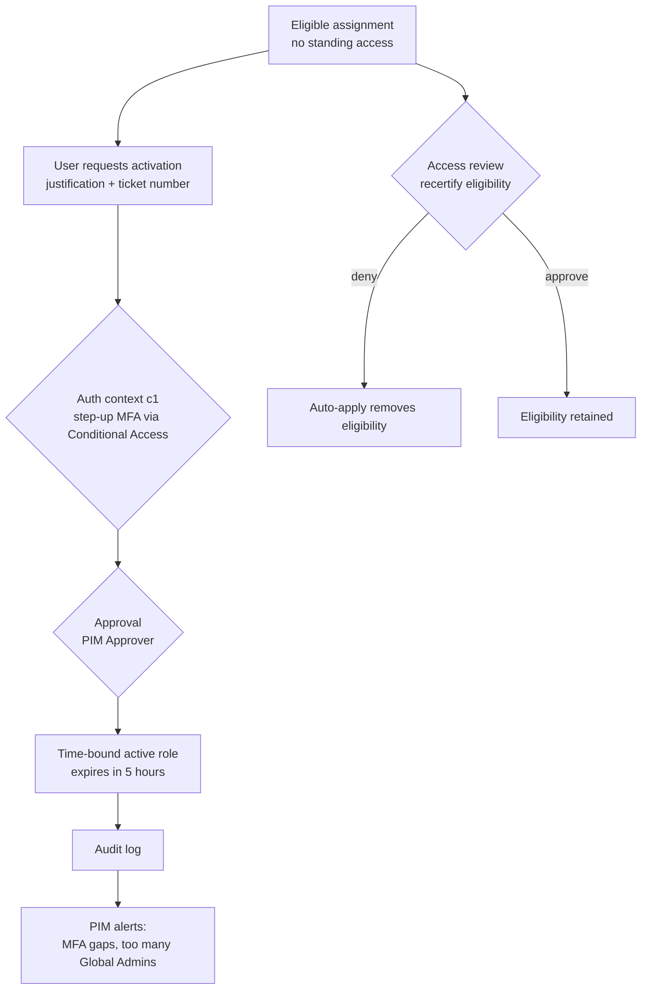
```mermaid
flowchart TD
    ELIG[Eligible assignment<br/>no standing access]
    REQ[User requests activation<br/>justification + ticket number]
    AC{Auth context c1<br/>step-up MFA via Conditional Access}
    APP{Approval<br/>PIM Approver}
    ACT[Time-bound active role<br/>expires in 5 hours]
    AUD[Audit log]
    ALERT[PIM alerts:<br/>MFA gaps, too many Global Admins]
    REV{Access review<br/>recertify eligibility}
    REM[Auto-apply removes eligibility]
    KEEP[Eligibility retained]

    ELIG --> REQ --> AC --> APP --> ACT --> AUD
    AUD --> ALERT
    ELIG --> REV
    REV -->|deny| REM
    REV -->|approve| KEEP
```

---

## Phase 1: PIM for Entra roles

**Concept:** Making a privileged directory role eligible instead of active is the core PIM move. `pim.user1` can activate User Administrator on demand, with MFA, justification, and a ticket required, but carries no admin rights the rest of the time.

**Why it matters:** A standing admin account is a permanent, high-value target that sits idle with full rights almost all the time, which is exactly the window an attacker wants after a phish. Eligibility shrinks that window to only the minutes the access is actually in use and logged, and tying each activation to a ticket makes every elevation traceable to a real task instead of silent standing power.

Result

Eligible assignment (no standing access):

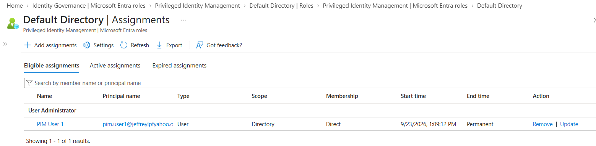

Activated (time-bound):

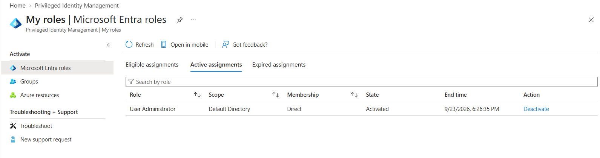

Configuration detail

Role setting, activation requirements (MFA, justification, ticket):

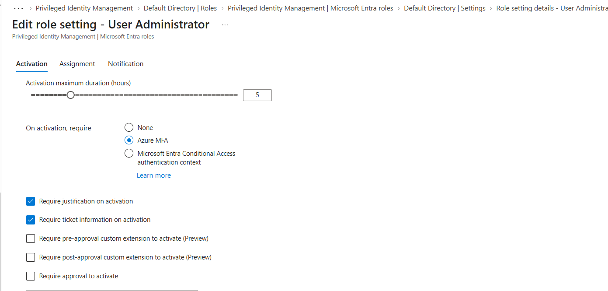

Role setting, assignment rules (eligible expiry, MFA on active assignment):

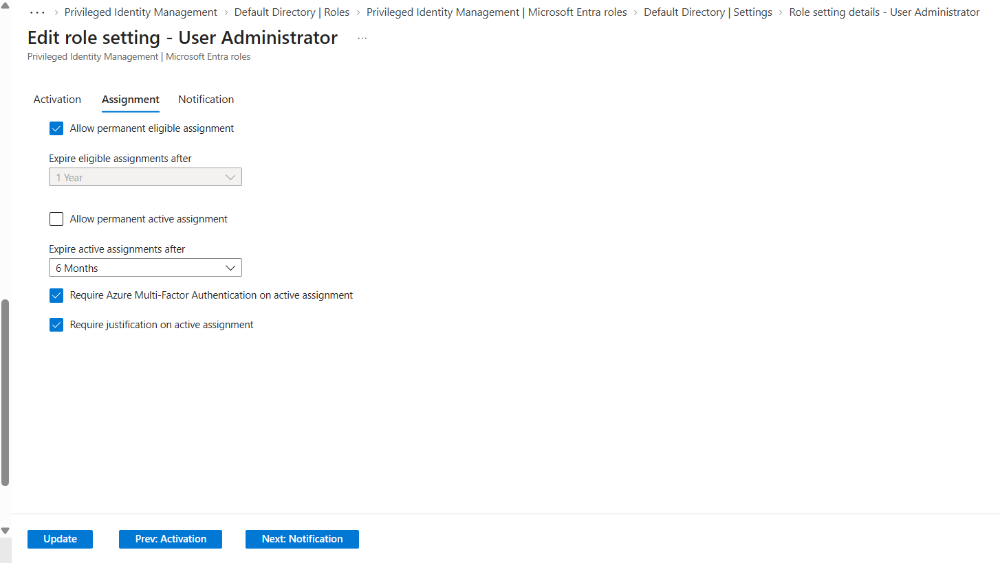

Eligible assignment configuration:

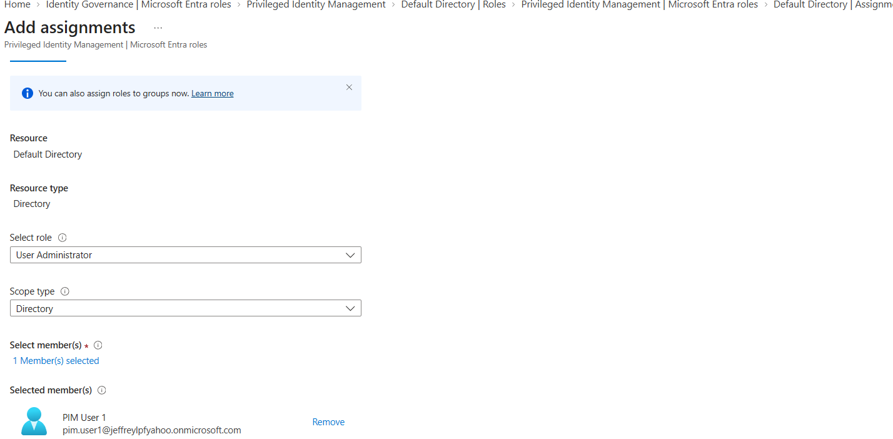

Activation with justification and ticket:

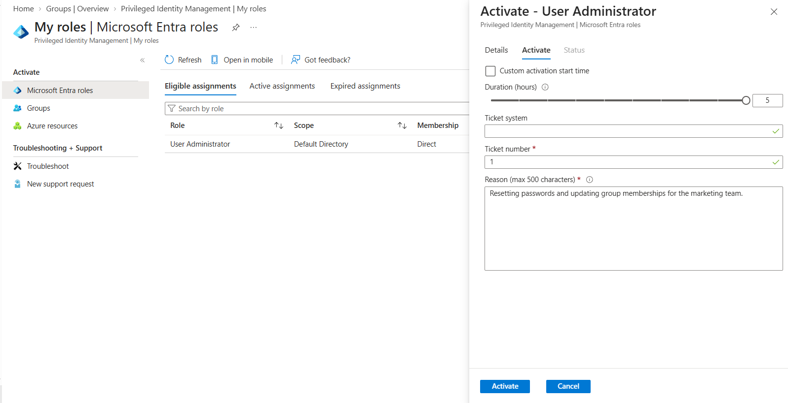

---

## Phase 2: PIM for Groups

**Concept:** PIM for Groups extends just-in-time elevation to group membership. `pim.user2` is eligible for the `PIM-Users` group and activates into it only when needed.

**Why it matters:** Not all privilege is a directory role. Access granted through group membership (app roles, SaaS entitlements, role-assignable groups) is a blind spot if only directory roles are just-in-time. Governing groups with PIM closes that gap so membership-based privilege is also time-bound, and it provides JIT for privileged access that has no native PIM role of its own.

Result

Eligible group membership:

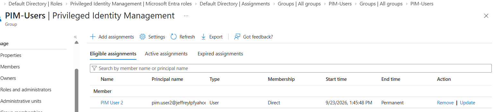

Activated membership:

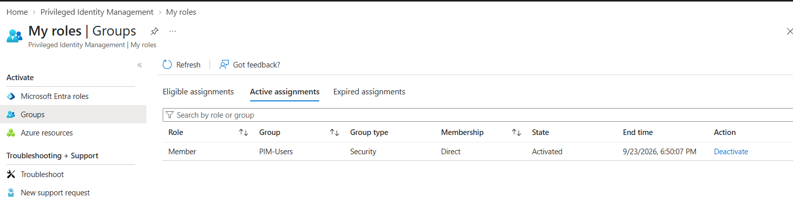

Configuration detail

Group member activation settings:

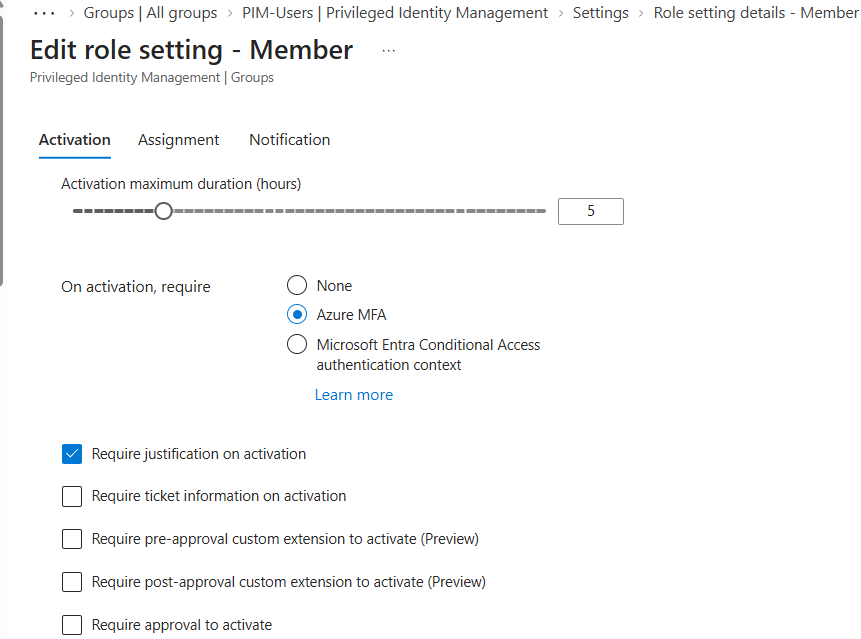

---

## Phase 3: PIM for Azure resources

**Concept:** PIM also governs Azure RBAC, a separate authorization system from Entra roles. Contributor on the subscription is made eligible, so resource-plane privilege is just-in-time too.

**Why it matters:** Entra roles and Azure RBAC are two distinct planes: a Global Administrator is not automatically an Azure Owner, and both real incidents and the exam hinge on that separation. A standing Contributor on a subscription has an enormous blast radius, so making it eligible means any change to cloud resources requires a deliberate, audited elevation rather than being permanently available.

Result

Eligible Azure resource role:

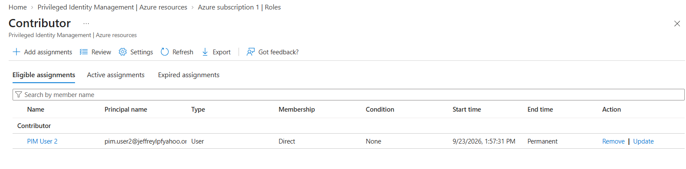

Activated Azure resource role:

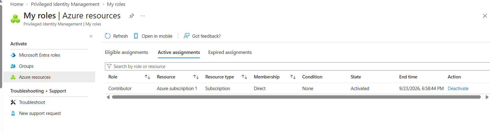

---

## Phase 4: Approval workflow

**Concept:** Requiring approval to activate adds a human gate. `pim.user2` requests User Administrator, and `pim.approver`, a different identity, must approve before the role goes active.

**Why it matters:** MFA and justification prove who is elevating and why, but not whether it should be allowed at all. Approval enforces separation of duties so no one self-elevates into sensitive privilege, and it means a single compromised account cannot silently escalate. The named-approver-plus-fallback design matters because manager-based approval breaks when the manager attribute is empty, which is a common real-world gap.

Result

Requester's pending activation:

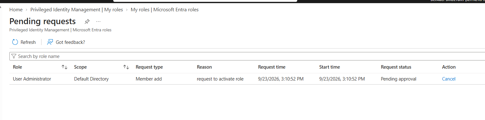

Approver's pending queue:

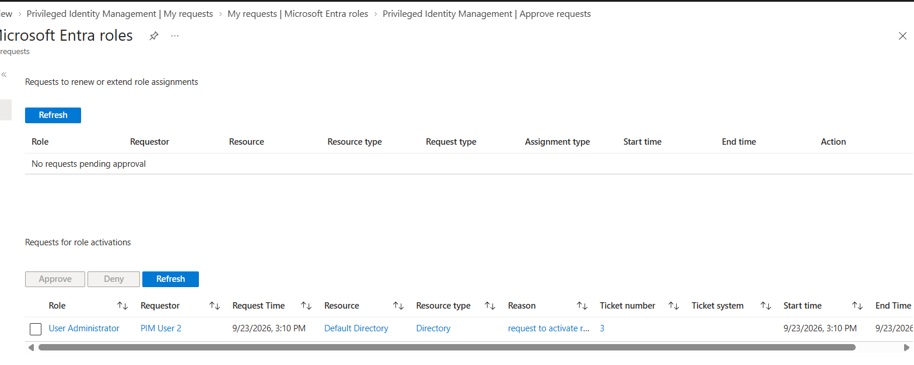

Role active after approval:

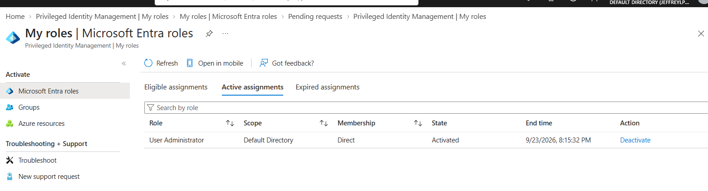

Configuration detail

Require approval, with a named approver:

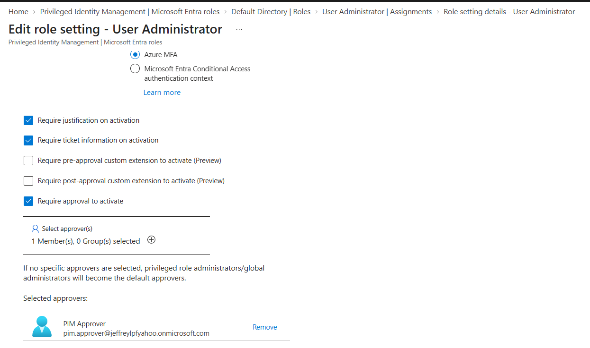

---

## Phase 5: Conditional Access authentication context

**Concept:** Instead of a static "require MFA on activation," the role's activation is wired to a Conditional Access authentication context (`c1 - Privileged activation`). Activation then inherits whatever that Conditional Access policy demands.

**Why it matters:** A fixed MFA toggle cannot adapt. Routing activation through Conditional Access lets the elevation demand phishing-resistant MFA, a compliant device, or a trusted location, and lets those requirements change centrally without editing every role one by one. It reserves the strongest controls for the moment they matter most, the act of elevation, instead of burdening every sign-in, which is Zero Trust's "verify explicitly" applied at the point of privilege.

Result

Activation triggers the Conditional Access step-up:

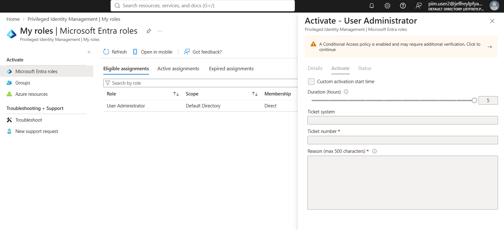

Step-up MFA challenge:

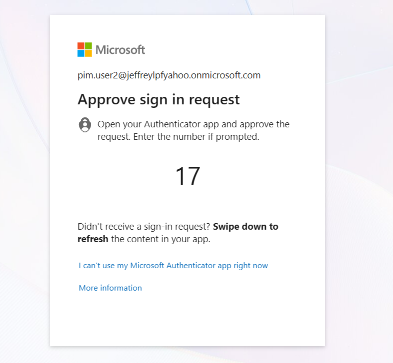

Role activated after step-up:

Configuration detail

Authentication context created:

Conditional Access policy for the context (grant: require MFA):

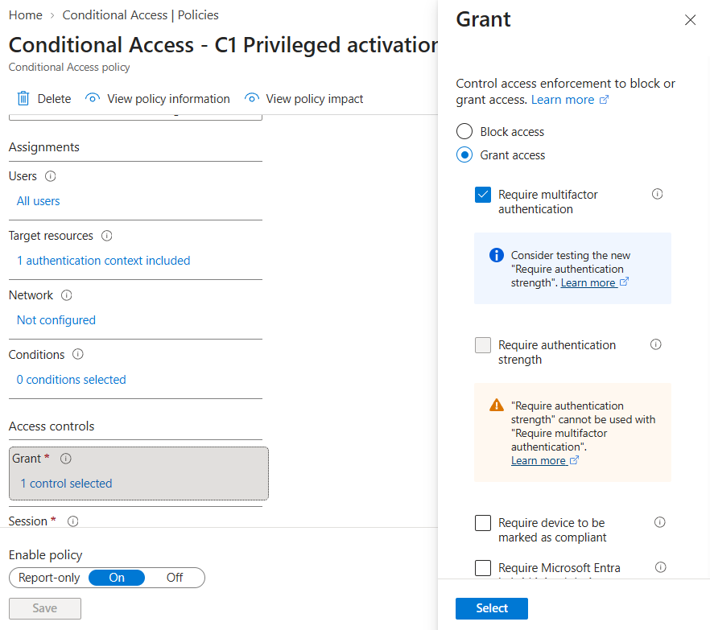

Role setting pointed at the authentication context:

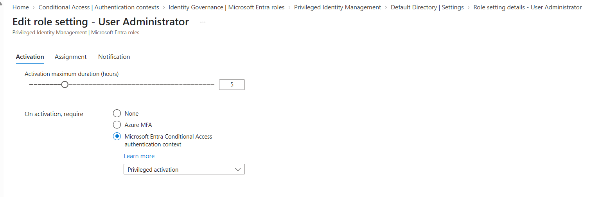

---

## Phase 6: PIM alerts

**Concept:** PIM alerts flag privilege-hygiene problems. The "Roles don't require MFA for activation" alert fired because Directory Readers had no MFA-on-activation setting, and was cleared with the built-in Fix.

**Why it matters:** Privileged access configuration drifts over time: Global Admins accumulate, roles get activated outside PIM, eligible assignments go stale. Alerts are the continuous-monitoring layer that turns PIM from a one-time setup into ongoing hygiene. This particular alert also shows that role-level and tenant-level controls are evaluated independently, so a role can be non-compliant even in a tenant that already enforces MFA through Conditional Access.

Result

Alert fired (a role without MFA on activation):

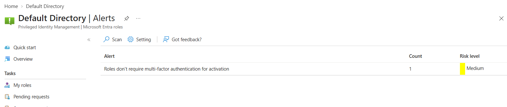

Alert cleared after remediation:

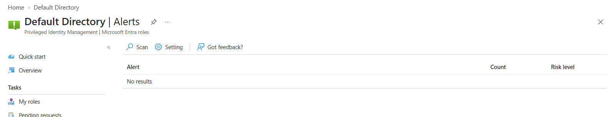

Configuration detail

Alert detail and one-click Fix:

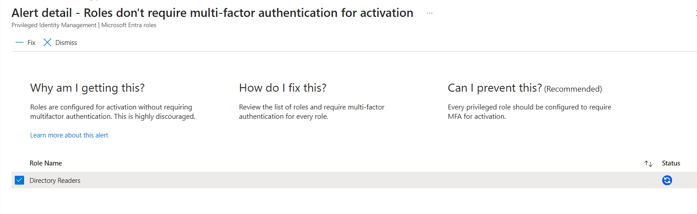

---

## Phase 7: Access review of eligible privileged assignments

**Concept:** An access review recertifies who should stay eligible for User Administrator, scoped to eligible assignments, using decision helpers based on sign-in activity, with auto-apply enforcing the outcome.

**Why it matters:** Eligibility accumulates silently. People change teams and projects end, but their eligible assignments linger, recreating standing-privilege risk in slow motion. Recertification is the periodic "should this person still be able to elevate?" control, and scoping it to eligible privileged assignments targets the highest-risk access. Auto-apply plus activity-based decision helpers make the review actually enforce and scale, instead of becoming a rubber stamp.

Result

Denied decision on the eligible user:

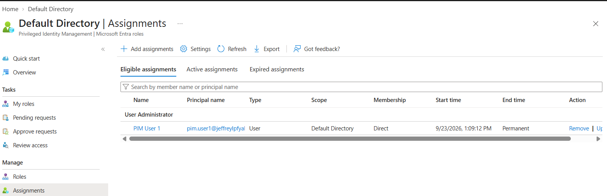

Review results (one approved, one denied):

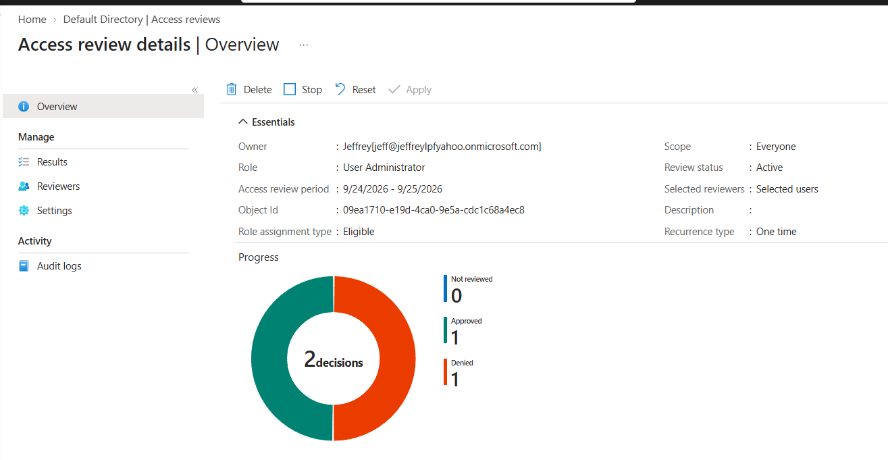

Configuration detail

Review configuration (eligible assignments only, auto-apply):

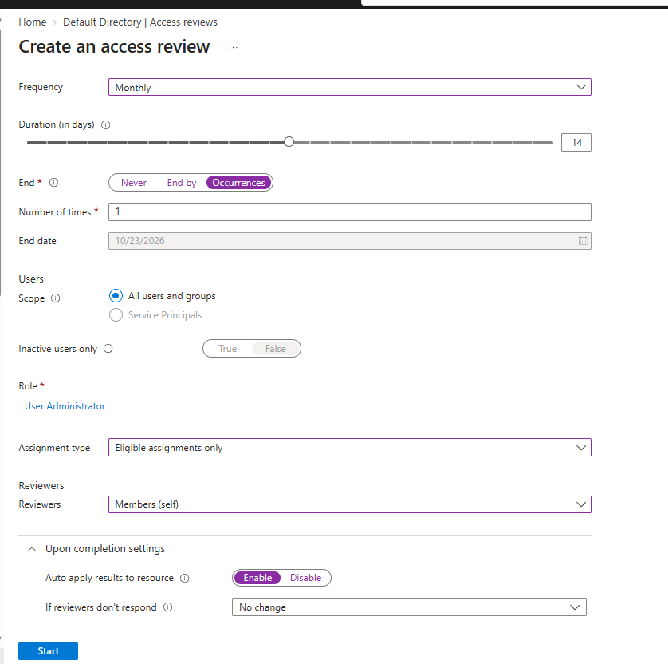

---

## Phase 8: Audit

**Concept:** The audit trail records the full privileged-access lifecycle: assignments, activations, approvals, and review decisions, each with the initiator captured.

**Why it matters:** A just-in-time control is only as strong as the evidence it produces. The audit log is what proves to an auditor or an incident responder who elevated, when, why, who approved it, and who was removed. In a PCI DSS or SOC 2 environment that trail is the difference between claiming least privilege and being able to demonstrate it.

Result

Access review audit log (create, update, approve, deny):

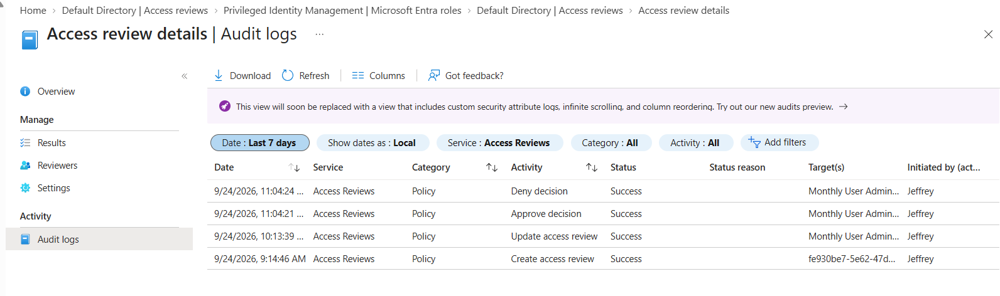

---

## PIM configuration summary

| Role / group | PIM surface | Max duration | MFA | Justification | Ticket | Approval | Auth context |
|---|---|---|---|---|---|---|---|
| User Administrator | Entra role | 5h | Yes (via auth context) | Yes | Yes | Yes (PIM Approver) | c1 - Privileged activation |
| PIM-Users (member) | PIM for Groups | 5h | Yes (Azure MFA) | Yes | No | No | None |
| Contributor (subscription) | Azure resource | Configured | Yes | Yes | No | No | None |
| Directory Readers | Entra role | Default | Yes (after Fix) | Default | No | No | None |

---

## Key Concepts Demonstrated

- **Just-in-time privilege:** roles are eligible, not standing; an admin holds the role only for a time-bound activation window.
- **Eligible vs active:** the core PIM distinction, applied across all three surfaces so privilege is requested, not permanently held.
- **Least privilege for administration:** the same principle applied to admin rights themselves, not just resource access.
- **Separation of duties:** activation of a privileged role is gated by a different identity's approval.
- **Step-up authentication:** a Conditional Access authentication context forces stronger verification at the moment of elevation, tied directly to the activation.
- **Defense in depth:** a role can require MFA at the PIM level and again through Conditional Access, which are two independent controls.
- **Two authorization planes:** Entra directory roles and Azure RBAC are separate systems, and PIM governs both alongside PIM for Groups.
- **Privileged access recertification:** access reviews periodically confirm who should remain eligible, with auto-apply enforcing the decision.
- **Auditability:** every activation, approval, and review decision is captured for evidence.

---

## Skills Demonstrated

- Configuring PIM role settings: activation duration, MFA, justification, ticket information, and approval
- Creating eligible assignments across Entra roles, PIM for Groups, and Azure resource roles
- Running just-in-time activation with an approval workflow
- Wiring a Conditional Access authentication context into PIM activation for step-up MFA
- Reading and remediating PIM alerts
- Designing and running an access review scoped to eligible privileged assignments with auto-apply
- Analyzing PIM and access review audit logs
- Troubleshooting a Conditional Access authentication-context activation loop

---

## Lessons Learned

- **An authentication context needs an enforced policy scoped to the user.** A report-only Conditional Access policy, or one that does not include the activating user, cannot satisfy the auth context, which produced a sign-in loop and a "couldn't sign you in" error at activation. Setting the policy to On and including the user fixed it.
- **PIM alerts read the role's own MFA setting, not tenant Conditional Access.** Directory Readers was flagged for missing MFA-on-activation even though a Conditional Access policy already required MFA for all users, because the alert evaluates the per-role PIM setting independently.
- **Scheduled access reviews instantiate on a delay.** A review with a past start date can sit at "Not started" for hours before going Active; recreating it with the current start date is the reliable unstick.
- **Review decisions are recorded but enforced only on apply.** The approve and deny decisions log under the Access Reviews service immediately, but the actual removal of a denied user's eligibility happens when the review is applied or completes, and that removal is what appears in the PIM resource audit.
- **Manager-as-approver and self-review are weak for privileged roles.** A named approver and a designated reviewer are the stronger designs, since self-attestation of admin access rarely removes anything.
