# Microsoft Entra Identity Governance Lab

Entitlement management and access reviews built end to end in a Microsoft Entra ID P2 trial tenant, demonstrating self-service access with approval, time-bound assignments, governed external access, and access recertification with automatic remediation.

This lab covers the **Plan and automate identity governance** domain of SC-300 and the "govern" stage of my broader Entra identity platform work.

---

## The concept in one line

Identity governance answers three questions continuously: **who should have access, are they using it appropriately, and how is it removed when they no longer need it.** This lab implements all three across the joiner-mover-leaver (JML) lifecycle, anchored to the principle of least privilege and Zero Trust's "verify explicitly."

| Governance question | Control in this lab | JML stage |
|---|---|---|
| Who should get access, and who approves it? | Access packages + approval policy | Joiner / Mover |
| Is the access still appropriate? | Access reviews (recertification) | Mover |
| How is access removed? | Assignment expiry + external-user lifecycle + auto-apply | Leaver |

---

## What this lab demonstrates

| Capability | SC-300 objective |
|---|---|
| Catalogs and delegated catalog ownership | Create and configure catalogs |
| Access packages with resource roles | Create and configure access packages |
| Single-stage approval with justification | Manage access requests |
| Time-bound assignments with expiry | Plan entitlements |
| Terms of use enforced via Conditional Access | Implement and manage terms of use |
| Connected organizations + external-user lifecycle | Manage the lifecycle of external users |
| Access review with decision helpers and auto-apply | Plan, implement, and manage access reviews |

**Licensing:** everything here runs on Microsoft Entra ID P2. Notes on the P2 vs Entra ID Governance SKU boundary are in [Licensing findings](#licensing-findings).

---

## Architecture

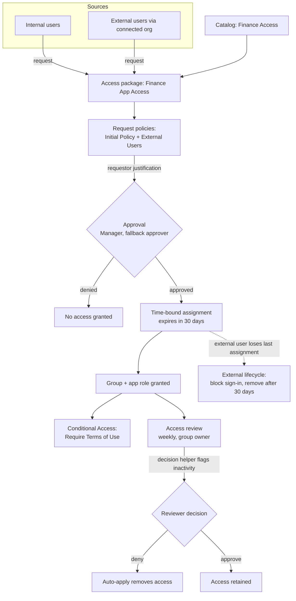

---

## Phase 0: Environment and test cast

**Concept:** Governance controls act on identities, so the test cast is modeled to mirror separation of duties. The requester, approver, and reviewer are deliberately different accounts. No single identity both requests and approves its own access.

Screenshots: test users and group owner

Test identities: a requester, an approver, a resource owner (reviewer), and a B2B guest for the external path.

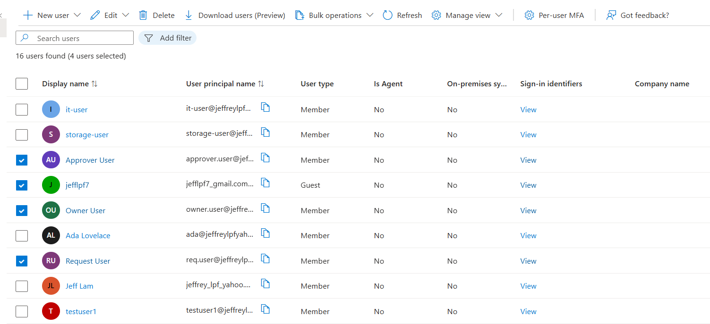

`SG-Finance-App-Users` given a dedicated owner so the access review routes to a resource owner, not to me directly.

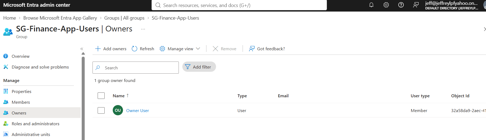

---

## Phase 1: Catalog

**Concept:** A catalog is the delegation boundary of entitlement management. It lets a resource owner govern their own resources without holding a tenant-wide admin role, which is least privilege applied to administration itself. Enabling external users at creation is what later allows guests to be governed through it.

Screenshot: catalog overview

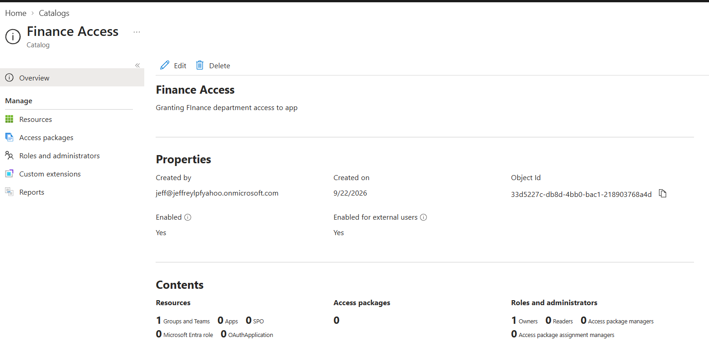

---

## Phase 2: Access package with approval

**Concept:** The access package separates two things that are easy to conflate: **what access you receive** (resource roles) and **who may request it and how it is approved** (the policy). Approval with required justification creates the audit trail; the 30-day expiry means the entitlement is time-bound rather than standing privilege. Both are core least-privilege ideas.

Screenshots: request scope, approval, requestor info, lifecycle

**Who can request:**

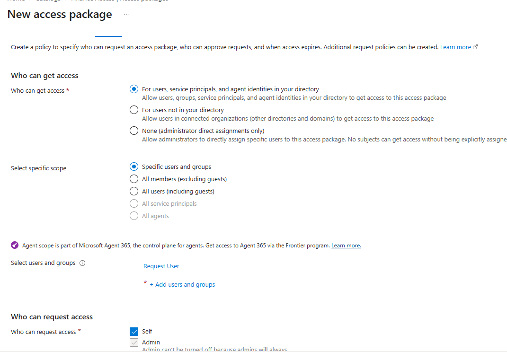

**Approval:** single-stage, Manager as approver with a named fallback, requestor and approver justification required, 14-day decision deadline.

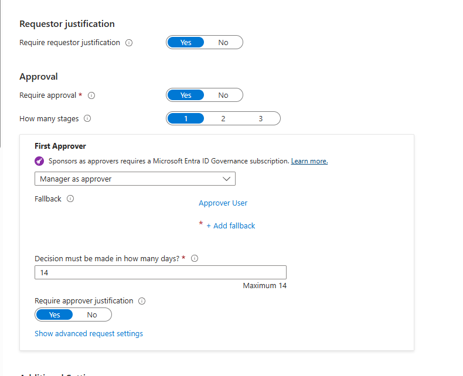

**Requestor information:** a custom "Business justification for access?" question captured for the audit trail.

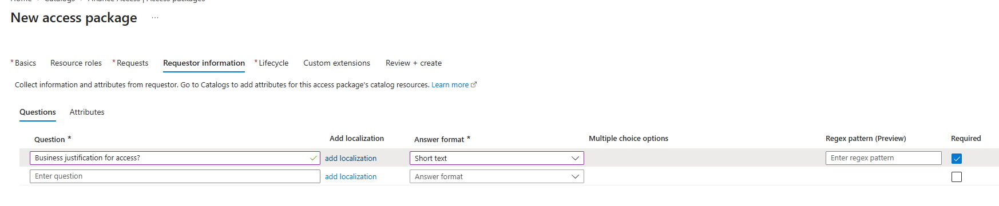

**Lifecycle:** assignments expire after 30 days, and access reviews are required on the assignment.

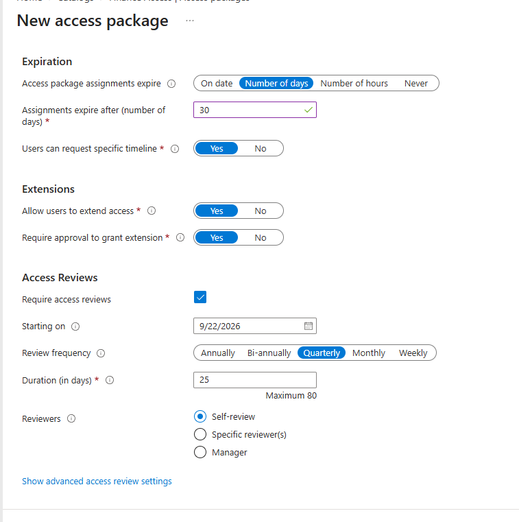

> **Understanding note:** "Manager as approver" depends on the requester having a manager attribute set. My test user had none, so approval fell through to the named fallback. In production the manager attribute must be populated and maintained, or approvals stall silently.

---

## Phase 3: Terms of use

**Concept:** Terms of use is the compliance-consent gate. It is authored under Identity Governance but enforced through a Conditional Access grant control, which shows the governance plane and the access plane are wired together rather than separate. Acceptance is recorded, which is what an auditor looks for.

Screenshots: ToU object and Conditional Access policy

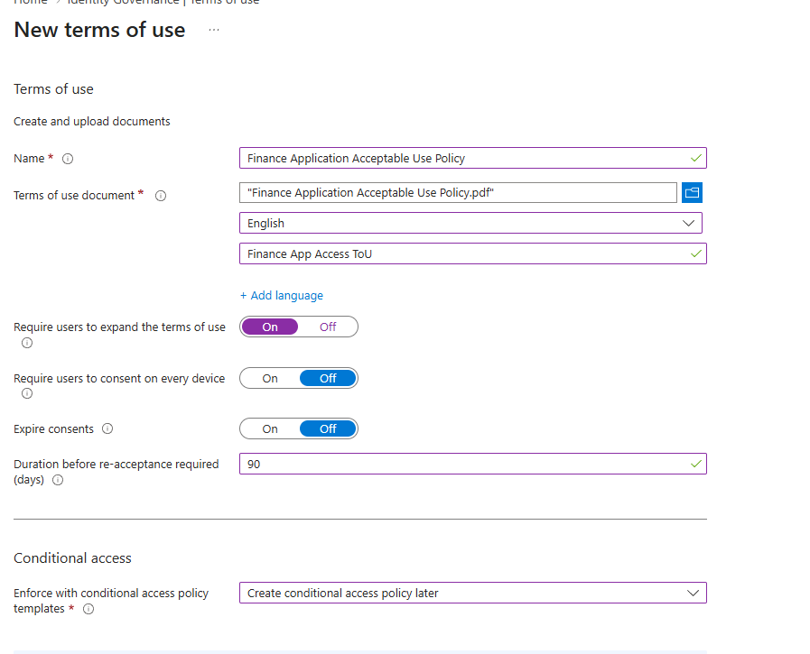

The ToU referenced as a grant control in a CA policy targeting the finance group, with the break-glass account excluded.

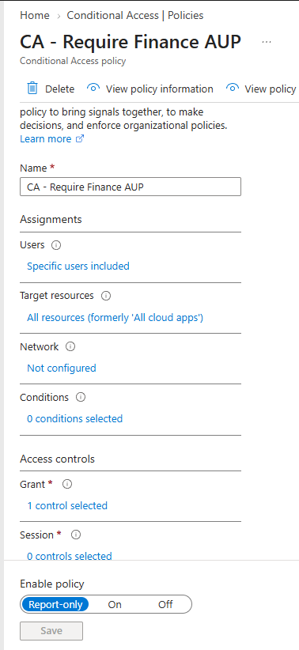

---

## Phase 4: External users

**Concept:** Guests are the higher-risk half of governance because they are outside the org's control. A connected organization defines which external partner is trusted to request access, and the external-user lifecycle automatically removes a guest once they lose their last assignment. That closes the orphaned-guest gap, which is one of the most common access-audit findings.

Screenshots: connected org, package policies, external-user lifecycle

**Connected organization** defines the trusted external partner.

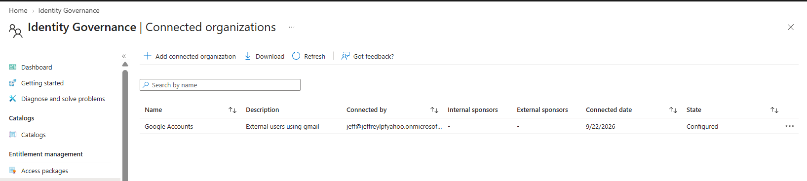

A second request policy (`External Users`) scopes external requests separately from internal ones.

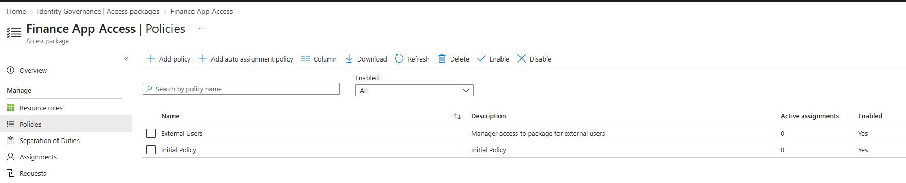

**External-user lifecycle:** a governed guest is blocked from sign-in and removed 30 days after losing their last access-package assignment.

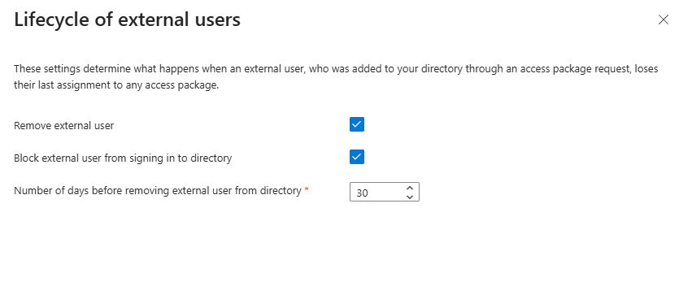

---

## Phase 5: Request flow end to end

**Concept:** This is the joiner/mover path in action. Self-service request with approval turns access from a manual help-desk ticket into a governed workflow: the user gets access faster, the org keeps control and a full evidence trail, and the entitlement carries its own expiry. Configured is not the same as proven, so the cycle was actually run.

Screenshots: request submitted, approval pending, assignment delivered

**Requester submits** through the My Access portal.

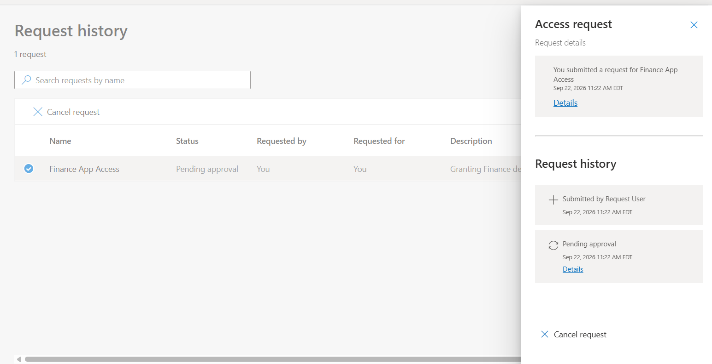

**Approver sees the pending request** and approves or denies with justification.

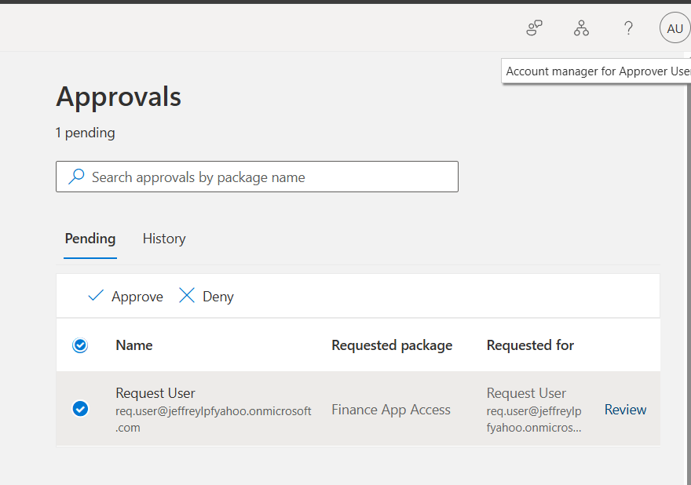

**Assignment delivered** after approval, with the 30-day expiry visible (end date 10/22/2026).

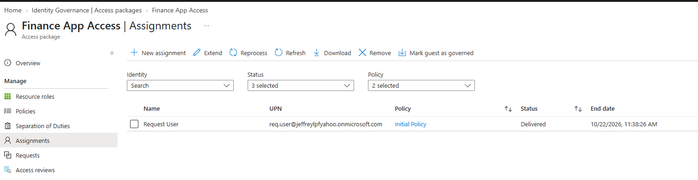

---

## Phase 6: Access review cycle (the governance report)

**Concept:** Access reviews are recertification, the periodic "does this person still need this?" control. It is what catches privilege creep over time and satisfies SOC 2 and PCI access-review requirements. Two pieces make it real rather than cosmetic: **decision helpers** surface inactivity so a reviewer is not eyeballing hundreds of users, and **auto-apply** turns the decision into enforced removal. That auto-removal is the leaver/cleanup stage of the lifecycle.

Screenshots: review config, settings, reviewer decision before and after

**Review configuration:** scoped to `SG-Finance-App-Users`, reviewer is the group owner, weekly recurrence.

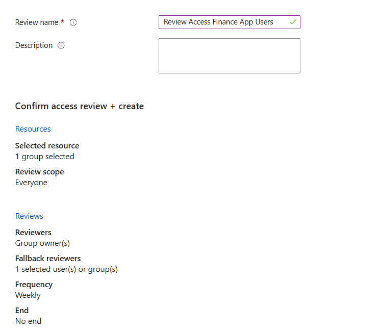

**Review settings:** auto-apply to the resource, remove access if reviewers do not respond, decision helpers on 30 days of sign-in inactivity, justification required.

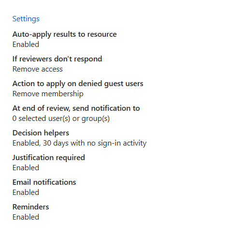

**Reviewer view (before):** decision helper recommends **Deny**, reason "Inactive user," signed in as the group owner.

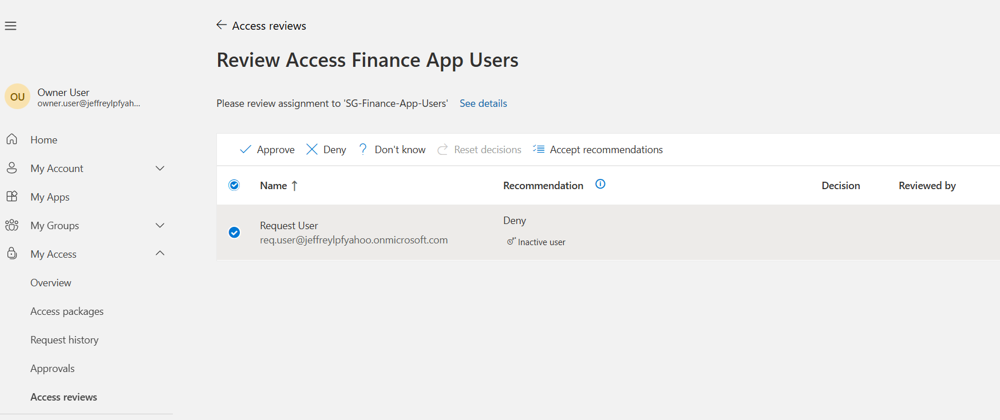

**Reviewer decision (after):** access denied, recorded against Owner User. Auto-apply then removes the membership.

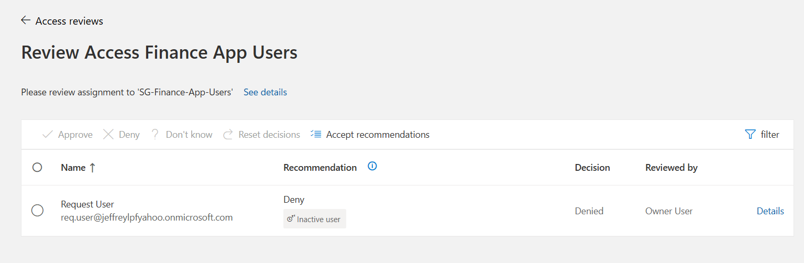

---

## Licensing findings

Confirmed live in the P2 trial tenant before building:

| Feature | Available on P2 trial |
|---|---|
| Entitlement management (catalogs, access packages) | Yes |
| Access reviews | Yes |
| Connected organizations | Yes |
| Terms of use | Yes |
| Lifecycle Workflows | No (requires Entra ID Governance SKU) |
| Access-package custom extensions | No (Governance SKU) |

Two boundaries worth noting:

- **Access packages are not reviewable from the global Access reviews blade.** That blade only offers Teams + Groups and Applications. Access-package assignment reviews are configured from the package's own policy lifecycle instead.
- **Reviewing guest users under governance now requires a linked Azure subscription** (change effective January 15, 2026, billed per unique guest). Reviews here were kept scoped to internal users to avoid that cost.

---

## Lessons learned

- **Manager-as-approver has a dependency.** With no manager attribute set, approval only works because a fallback approver was configured.
- **Two review types start differently.** A group review from the global blade instantiates quickly; a package-policy review is scheduled and can take up to a day, and its frequency (quarterly vs weekly) changes how soon the first instance appears.
- **Decision helpers are what make reviews scale.** The "Inactive user" flag came from last-sign-in data, which is how a reviewer handles hundreds of accounts.
- **Auto-apply is the difference between a report and a control.** Without it a review only produces a list of decisions; with it, denied access is actually removed.
- **Terms of use spans two planes.** Authored in governance, enforced only once wired into a Conditional Access grant control.
