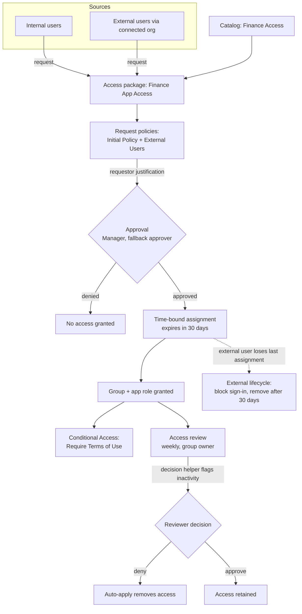

# Microsoft Entra Identity Governance Lab

Entitlement management and access reviews built end to end in a Microsoft Entra ID P2 trial tenant, demonstrating self-service access with approval, time-bound assignments, governed external access, and access recertification with automatic remediation.

This lab covers the **Plan and automate identity governance** domain of SC-300 (Microsoft Identity and Access Administrator) and the "govern" stage of my broader Entra identity platform work.

---

## What this lab demonstrates

| Capability | SC-300 objective |
|---|---|
| Catalogs and delegated catalog ownership | Create and configure catalogs |
| Access packages with resource roles | Create and configure access packages |
| Single-stage approval with justification | Manage access requests |
| Time-bound assignments with expiry | Plan entitlements |
| Terms of use enforced via Conditional Access | Implement and manage terms of use |
| Connected organizations + external-user lifecycle | Manage the lifecycle of external users |
| Access review with decision helpers and auto-apply | Plan, implement, and manage access reviews |

**Licensing:** everything here runs on Microsoft Entra ID P2. Notes on the P2 vs Entra ID Governance SKU boundary are in [Licensing findings](#licensing-findings).

---

## Architecture

---

## Phase 0: Environment and test cast

Test identities created to exercise the governance flows: a requester, an approver, a resource owner (who acts as reviewer), and a B2B guest for the external path.

`SG-Finance-App-Users` was created with a dedicated owner so the access review could route to a resource owner rather than to me directly.

---

## Phase 1: Catalog

The catalog is the governance boundary that groups resources so they can be delegated and packaged as a unit. `Finance Access` was enabled for external users at creation, which is required before guests can be governed through it later.

---

## Phase 2: Access package with approval

The access package `Finance App Access` bundles the group (and app role) that a requester receives, gated by a request policy.

**Who can request:**

**Approval:** single-stage, Manager as approver with a named fallback, requestor and approver justification required, 14-day decision deadline.

> Note: because the test requester has no manager set, approval fell through to the fallback approver. This is worth understanding for the exam: "Manager as approver" needs a manager attribute populated, or a fallback, or the request stalls.

**Requestor information:** a custom "Business justification for access?" question captured for the audit trail.

**Lifecycle:** assignments expire after 30 days, and access reviews are required on the assignment.

<!-- Optional: add screenshots/02-package-resource-roles.png (the Resource roles tab showing the group + app role) if captured -->

---

## Phase 3: Terms of use

Terms of use is created under Identity Governance but enforced through Conditional Access, linking the governance and access-management domains.

The ToU is referenced as a grant control in a Conditional Access policy targeting the finance group, with the break-glass account excluded.

<!-- Optional: flip the CA policy from Report-only to On, then add:
     screenshots/03-tou-acceptance-prompt.png (the acceptance screen an end user sees when the policy fires) -->

---

## Phase 4: External users

**Connected organization** defines which external partner is allowed to request the package.

A second request policy (`External Users`) scopes external requests separately from internal ones.

**External-user lifecycle:** when a governed guest loses their last access-package assignment, they are blocked from sign-in and removed after 30 days. This is the automatic-cleanup control that prevents orphaned guest accounts.

---

## Phase 5: Request flow end to end

The full cycle, executed with real test accounts rather than just configured.

**Requester submits** through the My Access portal:

**Approver sees the pending request** and can approve or deny with justification:

**Assignment delivered** after approval, with the 30-day expiry visible (end date 10/22/2026):

This chain (request → approval → time-bound assignment) is the core evidence that entitlement management works as a governed process, not a manual group edit.

---

## Governance report: the access review cycle

The recertification half of the lab, run end to end.

**Review configuration:** scoped to `SG-Finance-App-Users`, reviewer is the group owner, weekly recurrence.

**Review settings:** auto-apply results to the resource, remove access if reviewers do not respond, decision helpers based on 30 days of sign-in inactivity, and justification required.

**Reviewer view (before decision):** the decision helper recommends **Deny** with reason "Inactive user," signed in as the group owner:

**Reviewer decision (after):** access denied, recorded against Owner User:

With auto-apply enabled, the denied user's group membership is removed automatically, closing the loop from detection to remediation.

<!-- Optional: add screenshots/06-membership-after-removal.png (SG-Finance-App-Users members list showing the denied user removed) to prove auto-apply fired -->

---

## Licensing findings

Confirmed live in the P2 trial tenant before building:

| Feature | Available on P2 trial |
|---|---|
| Entitlement management (catalogs, access packages) | Yes |
| Access reviews | Yes |
| Connected organizations | Yes |
| Terms of use | Yes |
| Lifecycle Workflows | No (requires Entra ID Governance SKU) |
| Access-package custom extensions | No (Governance SKU) |

Two boundaries worth noting:

- **Access packages are not reviewable from the global Access reviews blade.** That blade only offers Teams + Groups and Applications. Access-package assignment reviews are configured from the package's own policy lifecycle instead.
- **Reviewing guest users under governance now requires a linked Azure subscription** (change effective January 15, 2026, billed per unique guest). To avoid that cost, reviews in this lab were kept scoped to internal users.

---

## Lessons learned

- **Manager-as-approver has a dependency.** With no manager attribute set, approval only works because a fallback approver was configured. In a real tenant the manager attribute has to be populated and maintained, or fallbacks planned.
- **Two review types start differently.** A group review created from the global blade instantiates quickly; a package-policy review is scheduled and can take up to a day to become active, and its frequency (quarterly vs weekly) changes how soon the first instance appears. For a fast lab cycle, weekly is the right choice.
- **Decision helpers are what make reviews scale.** The "Inactive user" recommendation came from last-sign-in data. In a real review of hundreds of users, a reviewer leans on those signals instead of eyeballing every account.
- **Auto-apply is the difference between a report and a control.** Without it, a review only produces a list of decisions. With it, denied access is actually removed.
- **Terms of use spans two domains.** It is authored in governance but only enforced once wired into a Conditional Access grant control.

---

## Repo placement

This lab is the governance component of my Entra identity platform work. It can stand alone or slot under the "govern" stage alongside the CIEM/least-privilege and privileged-access (PIM) labs.
